# 项目介绍


`JeecgBoot` 是一款基于代码生成器的`低代码`开发平台，零代码开发！采用前后端分离架构：SpringBoot2.x，Ant Design&Vue，Mybatis-plus，Shiro，JWT。强大的代码生成器让前后端代码一键生成，无需写任何代码! JeecgBoot引领新的开发模式(Online Coding模式-> 代码生成器模式-> 手工MERGE智能开发)， 帮助解决Java项目70%的重复工作，让开发更多关注业务逻辑。既能快速提高开发效率，帮助公司节省成本，同时又不失灵活性！JeecgBoot还独创在线开发模式（No代码概念）：在线表单配置（表单设计器）、移动配置能力、工作流配置（在线设计流程）、报表配置能力、在线图表配置、插件能力（可插拔）等等！

`JeecgBoot在提高UI能力`的同时，降低了前后分离的开发成本，JeecgBoot还独创在线开发模式（No代码概念），一系列在线智能开发：在线配置表单、在线配置报表、在线图表设计、在线设计流程等等。
`JEECG宗旨是:`简单功能由Online Coding配置实现（在线配置表单、在线配置报表、在线图表设计、在线设计流程、在线设计表单），复杂功能由代码生成器生成进行手工Merge，既保证了智能又兼顾了灵活;
业务流程采用工作流来实现、扩展出任务接口，供开发编写业务逻辑，表单提供多种解决方案： 表单设计器、online配置表单、编码表单。同时实现了流程与表单的分离设计（松耦合）、并支持任务节点灵活配置，既保证了公司流程的保密性，又减少了开发人员的工作量。

- 官方网站： [http://www.jeecg.com](http://www.jeecg.com/)
- 源码下载： http://www.jeecg.com/download
- QQ交流群：⑤860162132、④774126647(满)、③816531124(满)、②769925425(满)、①284271917(满)
- 在线演示： [http://boot.jeecg.com](http://boot.jeecg.com/)
- 在线演示(VUE3beta版)：[http://boot3.jeecg.com](http://boot3.jeecg.com/)
- 版本日志： http://www.jeecg.com/doc/log
- 低代码快速体验： [一分钟快速学习](https://my.oschina.net/jeecg/blog/3083313)
- 新手指南： [快速入门](http://www.jeecg.com/doc/quickstart) | [常见问题 ](http://www.jeecg.com/doc/qa)| [视频教程](https://www.bilibili.com/video/BV1Y541147m1) | [反馈问题](https://github.com/zhangdaiscott/jeecg-boot/issues)

技术架构：

```
后端技术： SpringBoot_2.1.3.RELEASE + Mybatis-plus_3.1.2 + Shiro_1.4.0 + Jwt_3.7.0  
          + Swagger-ui + Redis 
前端技术： Ant-design-vue + Vue + Webpack
其他技术： Druid（数据库连接池）、Logback（日志工具） 、poi（Excel工具）、
          Quartz（定时任务）、lombok（简化代码）
项目构建： Maven、Jdk8
```

前端开发必读文档：

前端UI组件： Ant Design of Vue
https://www.antdv.com/docs/vue/introduce
报表UI组件：viser-vue
https://viserjs.gitee.io/demo.html#/viser/bar/basic-bar

VUE基础知识：
https://cn.vuejs.org/v2/guide
Ant Design Vue Pro：
https://pro.loacg.com/docs/getting-started

# 新手入门教程

### Jeecg-Boot入门教程必看（新手学习）

> 我们精心制作本教程，方便开源用户和新入职成员快速掌握Jeecg-Boot开发。根据我们的实际经验，通过此教程学习，刚入行的毕业生也可以顺利的进行开发，所以请耐心完成本套教程的学习（有一定工作经验的，可以忽略自己熟悉的章节）。

> 1. 开发环境搭建 http://doc.jeecg.com/2043873
>
>    工具链接：https://pan.baidu.com/s/16z9qNtyk24bsrZxRFBHP2w 提取码：pagv
>
> 2. 项目如何启动 http://doc.jeecg.com/2043874
>
> 3. JeecgBoot视频 http://www.jeecg.com/doc/video
>
> 4. 代码生成器教程 http://doc.jeecg.com/2043916
>
> 5. 常见问题贴：http://jeecg.com/doc/qa
>
> 6. 必看学习资料(充电)
>    ES6 | [http://es6.ruanyifeng.com](http://es6.ruanyifeng.com/)
>    Vue | https://cn.vuejs.org/v2/guide
>    Ant Design of Vue | https://vue.ant.design/docs/vue/introduce-cn
>    Less | [https://less.bootcss.com](https://less.bootcss.com/)
>
> 7. 基础知识学习（Vue全家桶、Springboot） 参考下面《基础知识学习视频》
>
> 8. Bug反馈通道 https://github.com/zhangdaiscott/jeecg-boot/issues

**《基础知识学习视频》**

```
两套Springboot视频(建议第一套)
  链接：https://pan.baidu.com/s/1Yv1ttP1_b6ORrTGLPQ1n1g 提取码：gcjo
  链接：https://pan.baidu.com/s/11Z0iLW9o-W4-4tYHXlDO9A 提取码：7kz2 


两套vue视频，前后端分离

  1.Vue基础知识视频
  链接：https://pan.baidu.com/s/1r69bFZ0_N2-g4XNxEqDtfg 提取码：gt81 

  2.Vue高级视频教程
  链接：https://pan.baidu.com/s/1wL09TPdDlFtKrLTeKSv_Yw   提取码：lw5z 
  链接：https://pan.baidu.com/s/1-Kdlthotm27dJUijwm4sSQ   提取码：03sv
```

# 开发环境准备

## 基础开发环境

- JDK: 1.8
- Maven: 3.5+
- MySql: 5.7+
- Redis: 3.2 +
- Node Js: 10.0 +
- Npm: 5.6.0+
- Yarn: 1.21.1+

### IDE插件

- Lombok Plugin （必装）

### 推荐IDE

- 后端使用 IntelliJ IDEA
- 前端使用 IntelliJ IDEA 或 WebStorm

## 基础环境与工具安装

```
 JeecgBoot采用前后分离架构，官方推荐前后端都用IDEA
 前端开发： IDEA 或  Webstrom
 后端开发： IDEA 或 Eclipse
```

### 工具清单

> 链接：https://pan.baidu.com/s/16z9qNtyk24bsrZxRFBHP2w 提取码：pagv

- node-v12.13.1-x64.msi
- yarn-1.21.1.msi
- ideaIU-2019.2.3.exe
- jdk-8u191-windows-x64.exe
- apache-maven-3.5.4.zip
- redis64-3.0.501
- mysql-5.7.26-winx64.zip

### 前端环境安装（开发工具—帮助文档）

| 序号 | 工具                             | 描述                                          | 参考                                                         |
| :--- | :------------------------------- | :-------------------------------------------- | :----------------------------------------------------------- |
| 1    | Nodejs/Npm安装/Cnpm安装          | JavaScript运行环境，此处使用到它的包管理器npm | https://blog.csdn.net/zhangdaiscott/article/details/106114007 |
| 2    | Yarn安装                         | 下载包工具                                    | https://blog.csdn.net/zhangdaiscott/article/details/106115298 |
| 3    | WebStorm安装与使用（也可用IDEA） | WEB前端开发工具                               | https://blog.csdn.net/u011781521/article/details/53558979    |

### 配置Nodejs镜像

```
npm config set registry https://registry.npm.taobao.org --global
npm config set disturl https://npm.taobao.org/dist --global

yarn config set registry https://registry.npm.taobao.org --global
yarn config set disturl https://npm.taobao.org/dist --global
```

### 后端环境安装（开发工具—帮助文档）

> 后端开发建议采用IDEA，方便多Maven模块开发，热部署请集成JRebel。

| 序号 | 工具                         | 参考                                                         |
| :--- | :--------------------------- | :----------------------------------------------------------- |
| 1    | JDK8安装、Maven安装          | 此部分请百度                                                 |
| 2    | IDEA安装                     | https://jeecg.blog.csdn.net/article/details/103252484        |
| 3    | IDEA中Lombok插件的安装与使用 | https://www.cnblogs.com/iathanasy/p/9262689.html             |
| 4    | IDEA热部署JRebel安装         | https://blog.csdn.net/weixin_42831477/article/details/82229436 |
| 5    | IDEA自动生成类注释和方法注释 | https://my.oschina.net/jeecg/blog/3198358                    |
| 5    | ~~Eclipse安装lombok插件~~    | https://blog.csdn.net/qq_25646191/article/details/79639633   |
| 6    | ~~Eclipse自定义皮肤主题~~    | https://blog.csdn.net/StillOnMyWay/article/details/79109741  |
| 7    | ~~Eclipse常用快捷键~~        | https://blog.csdn.net/zhangdaiscott/article/details/52790087 |

### WebStorm-2018.1.3 开发入门配置

| 序号 | 标题                                                      | 链接                                                         |
| :--- | :-------------------------------------------------------- | :----------------------------------------------------------- |
| 1    | WebStorm安装与使用                                        | https://blog.csdn.net/u011781521/article/details/53558979    |
| 3    | 修改webstorm主题                                          | https://blog.csdn.net/master_yao/article/details/50675454    |
| 4    | Webstorm切换快捷键风格（Webstorm快捷键与eclipse对比介绍） | https://blog.csdn.net/gsying1474/article/details/52036443    |
| 5    | WebStorm SVN用法                                          | https://blog.csdn.net/hysh_keystone/article/details/52013789 |
| 6    | ‘svn’不是内部或外部命令问题解决                           | https://blog.csdn.net/mitea90/article/details/19075673       |
| 7    | 设置webstorm的vue新建文件模板(后面篇章)                   | https://blog.csdn.net/diligentkong/article/details/75040651  |
| 8    | WebStorm卡顿拉取svn慢解决                                 | https://blog.csdn.net/WYA1993/article/details/84671501       |

### 前端Webstorm开发界面

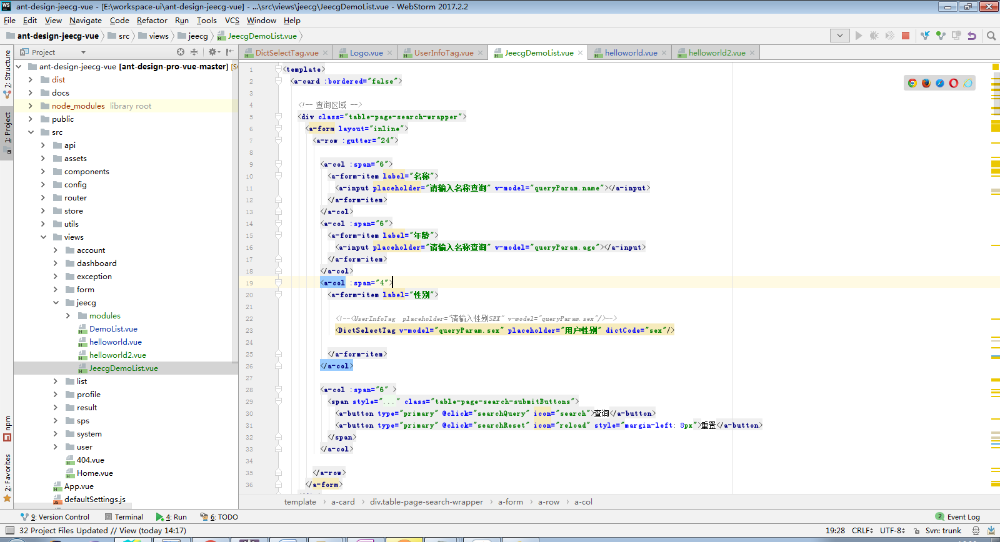

### 后端Eclipse开发界面

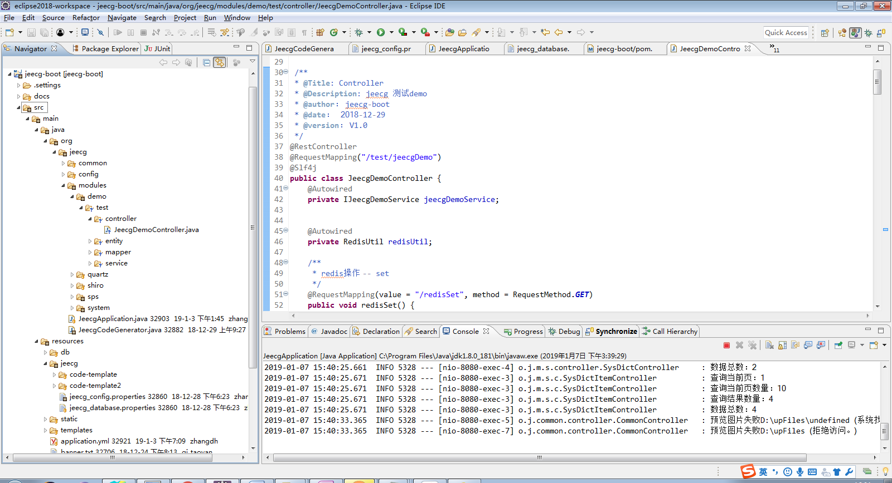

## 开发环境搭建

###  前端开发环境搭建

#### 一、安装开发工具

安装nodejs、webstrom、yarn,安装方法参照[【开发环境准备】-【开发工具】](http://doc.jeecg.com/2043872)

#### 二、导入项目

**1. 下载项目[[GitHub - jeecg-boot](https://github.com/jeecgboot/jeecg-boot)]**

**2、使用idea或webstrom导入项目**

（1）前端工程ant-design-jeecg-vue
（2）Webstrom打开项目
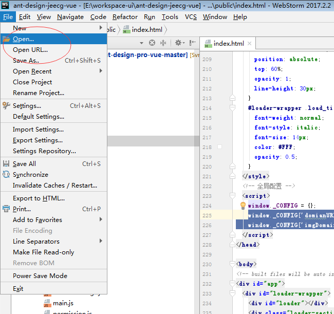

**3、本地开发构建运行**

（1）执行命令 yarn install 下载项目依赖
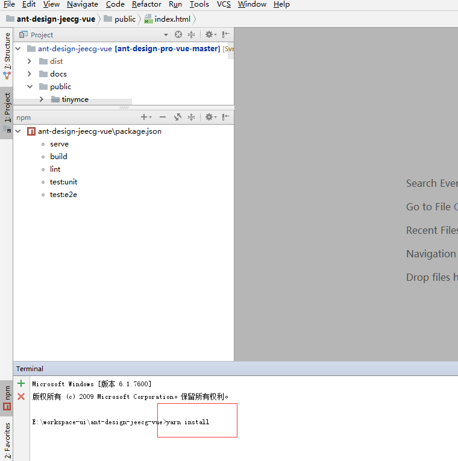
（2）项目依赖的模块下载完成，则项目构建完成

###  后端开发环境搭建

#### 一、安装开发工具

安装jdk、eclipse、redis等，安装方法参照[【开发环境准备】-【开发工具】](http://doc.jeecg.com/2043872)

#### 二、导入项目

**（1）安装jdk8、Maven、Redis、Mysql**

```
 此部分属于java基础不细讲，不会的百度吧！！
```

**（2）修改Maven镜像**

安装方法参照 [【开发环境准备】-【Maven私服设置】](http://doc.jeecg.com/2043876)

**（3）使用Idea或者Eclipse通过Maven方式导入项目**

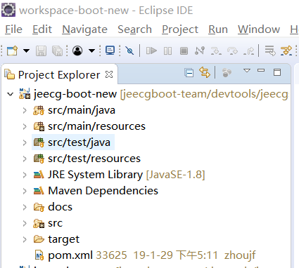
重新导入项目后，maven会自动下载项目依赖，至此后台项目环境搭建完成

## 如何启动项目

### 后端项目启动

```
项目结构
├─jeecg-boot-parent（父POM： 项目依赖、modules组织）
│  ├─jeecg-boot-base（共通模块： 工具类、config、权限、查询过滤器、注解、接口等）
│  ├─jeecg-boot-module-demo    示例代码
│  ├─jeecg-boot-module-system （系统管理权限等功能） -- 默认作为启动项目
│  ├─jeecg-boot-starter（微服务starter模块，不需要微服务可以删掉） 
│  ├─jeecg-cloud-module（微服务生态模块，不需要微服务可以删掉） 
```

#### （1）初始化数据库，要求mysql5.7+

```
 手工执行Sql脚本： jeecg-boot/db/jeecgboot-mysql-5.7.sql
 会自动建库和初始化数据。
```

#### （2）修改项目配置文件（数据库配置、redis配置）

```
 配置文件： jeecg-boot-module-system/src/main/resources/application-dev.yml
```

a. 数据库配置(连接和账号密码)
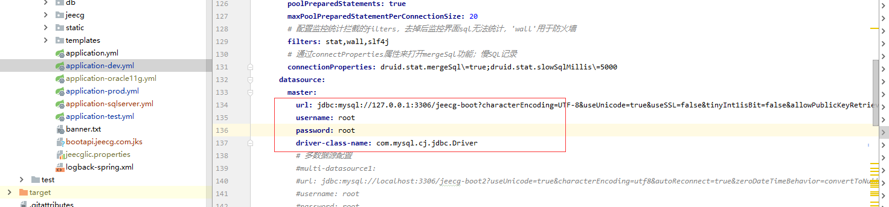

b. Redis配置（配置redis的host和port）
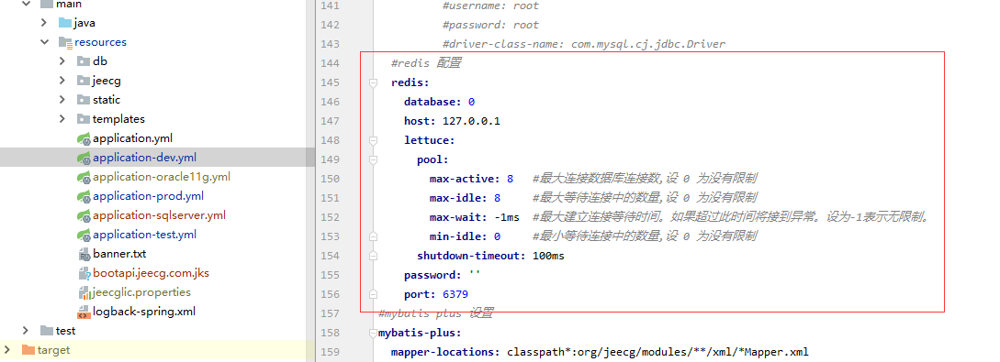

#### （3）启动redis服务

```
    这个应该都会，此处忽略
```

#### （4）启动项目&访问

以上配置完成后，即可启动后台项目
本地启动：jeecg-boot-module-system/src/main/java/org/jeecg/JeecgSystemApplication.java，右键执行启动。
通过 http://localhost:8080/jeecg-boot/doc.html 访问后台，默认进入swagger文档首页

### 前端项目启动

#### （1）执行命令下载依赖

执行命令 yarn install
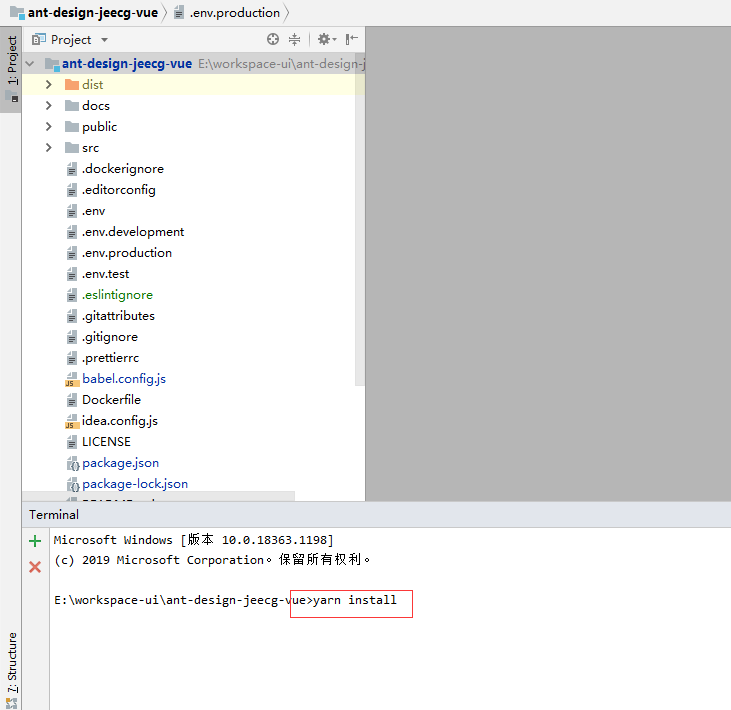

#### （2）配置后台接口

- a. 修改后台接口配置 .env.development
  [前端多环境构建详细文档](http://doc.jeecg.com/2043881)

```
NODE_ENV=development
VUE_APP_API_BASE_URL=http://localhost:8080/jeecg-boot
VUE_APP_CAS_BASE_URL=http://cas.example.org:8443/cas
VUE_APP_ONLINE_BASE_URL=http://fileview.jeecg.com/onlinePreview
```

~~\* b. vue.config.js（开发环境配置，此步骤可忽略）~~
此处映射地址配置到后台端口即可，如果后台项目名字修改了的话，直接改“/jeecg-boot”
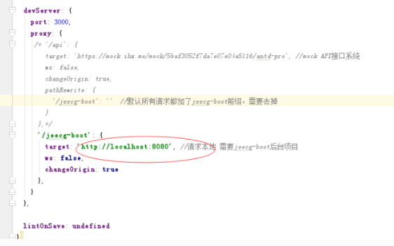

#### （3）启动项目

调出Show npm Scripts 功能
找到项目目录下文件package.json文件，鼠标右键选择Show npm Scripts
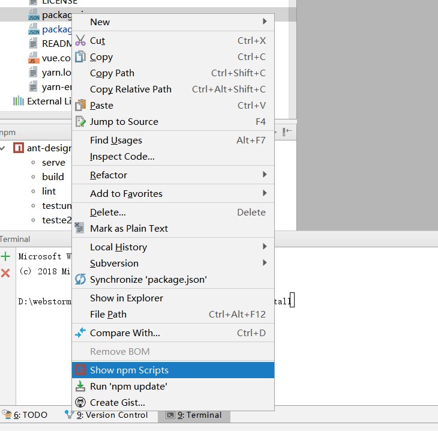

点击命令 serve 启动项目
看到如下日志 则启动成功

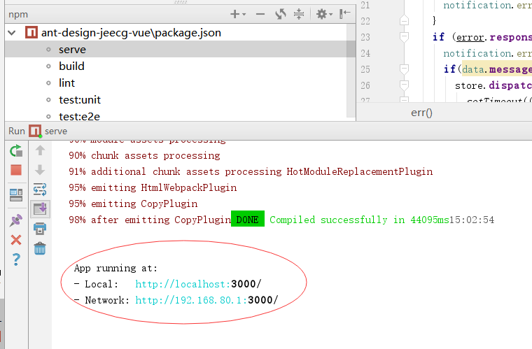
通过 [http://localhost:3000](http://localhost:3000/) 访问前端项目，默认账号密码： admin/123456

## 平台技术点

需要掌握的基础知识

| 序号 | 知识点               | 资料                                                     |
| :--- | :------------------- | :------------------------------------------------------- |
| 1    | Node.js 入门         | http://www.runoob.com/nodejs/nodejs-tutorial.html        |
| 2    | Npm 命令             | http://www.runoob.com/nodejs/nodejs-npm.html             |
| 3    | Yarn                 | 建议，比npm更快                                          |
| 4    | Vue                  | https://cn.vuejs.org/                                    |
| 5    | ES6                  | https://blog.csdn.net/itzhongzi/article/details/73330681 |
| 6    | Vue全家桶            | Webpack 、axios、Vue router、Vuex、Vue Loader、Vue cli   |
| 7    | Springboot           |                                                          |
| 8    | Mybatis-plus         | [https://mp.baomidou.com](https://mp.baomidou.com/)      |
| 9    | Shiro                |                                                          |
| 10   | Spring Cloud Alibaba | [微服务整体技术解决方案](http://doc.jeecg.com/2043893)   |

## Maven私服设置

> JEECG存在自定义JAR包，放在自己的Maven私服上面，所以有的时候会遇到下载失败。
> 一般遇到下载失败的情况，是因为用户设置了本地镜像，导致无法从JEECG私服下载资源
> 参考下面的方式进行镜像排除配置即可。

1. 找到 maven老家 conf/settings.xml，
   在标签内增加下面方式的阿里云maven镜像（删除自己的镜像配置）， 最终结果见下面：

```
<mirrors>
       <mirror>
            <id>nexus-aliyun</id>
            <mirrorOf>*,!jeecg,!jeecg-snapshots,!getui-nexus</mirrorOf>
            <name>Nexus aliyun</name>
            <url>http://maven.aliyun.com/nexus/content/groups/public</url>
        </mirror> 
 </mirrors>
```

此配置重点在这句话`<mirrorOf>*,!jeecg,!jeecg-snapshots</mirrorOf>`
如果不加这句话，默认所有的依赖都会去阿里云仓库下载，加上后jeecg的依赖包就可以从jeecg私服下载了。

## 数据库切换

### 1. Oracle数据

#### 1.1 添加oracle驱动，修改pom.xml

```
<!-- oracle驱动 -->
<dependency>
	<groupId>com.oracle</groupId>
	<artifactId>ojdbc6</artifactId>
	<version>11.2.0.3</version>
</dependency>
```

#### 1.2 修改数据库连接

```
修改druid配置
validationQuery: SELECT 1 FROM DUAL

driver-class-name: oracle.jdbc.OracleDriver
url: jdbc:oracle:thin:@192.168.1.200:1521:ORCL
username: jeecgboot
password: jeecgboot
```

### 2. SQL server数据

#### 2.1 添加SQL server驱动，修改pom.xml

```
<!--  sqlserver-->
<dependency>
	<groupId>com.microsoft.sqlserver</groupId>
	<artifactId>sqljdbc4</artifactId>
	<version>4.0</version>
	<scope>runtime</scope>
</dependency>
```

#### 2.2 修改数据库连接

```
修改druid配置
validationQuery: SELECT 1
filters: stat,slf4j


driver-class-name: com.microsoft.sqlserver.jdbc.SQLServerDriver
url: jdbc:sqlserver://192.168.1.200:1433;SelectMethod=cursor;DatabaseName=jeecg-boot
username: sa
password: SA

修改JPA加上database-platform参数
jpa:
  open-in-view: false
  database-platform: org.hibernate.dialect.SQLServerDialect
```

#### 2.3 sqlserver下定时任务报错处理

```
报错信息org.quartz.impl.jdbcjobstore.LockException: Failure obtaining db row lock: sql injection violation, syntax error: syntax error, not support option : UPDATE, pos 86, line 1, column 80, token UPDATE
```

修改配置如下：将selectWithLockSQL: SELECT* FROM {0}LOCKS UPDLOCK WHERE LOCK_NAME = ?配置在jobStore下

```
quartz:  
  .....省略其他配置.....  
  properties:  
     org:  
       quartz:  
          jobStore:  
            selectWithLockSQL: SELECT* FROM {0}LOCKS UPDLOCK WHERE LOCK_NAME = ?
```

#### 2.4 sqlserver下启动后，如果控制台一直滚动如下图信息

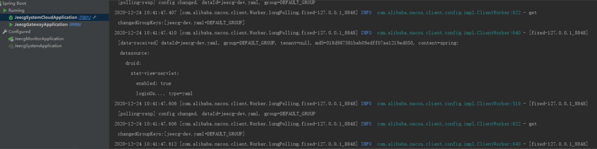
可修改配置文件

```
web-stat-filter:
       enabled:false
```


#### 2.5 sqlserver启动失败，报错--- 不支持“variant”数据类型

修改sqlserver版本即可解决，将sqljdbc4替换为mssql-jdbc

```xml
<dependency>
   <groupId>com.microsoft.sqlserver</groupId>
   <artifactId>mssql-jdbc</artifactId>
   <version>8.2.2.jre8</version>
</dependency>
```

报错信息：
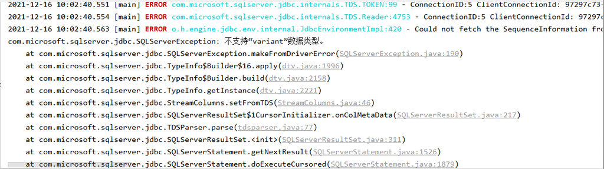
修改依赖jar包：
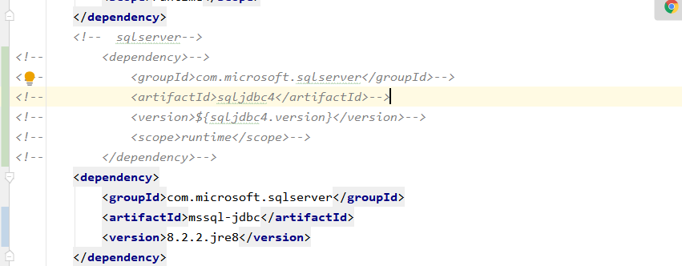

### 3. postgresql数据库

#### 3.1 添加postgresql驱动，修改pom.xml

(根据不同版本的数据库引入对应版本的驱动，下载地址：https://jdbc.postgresql.org/download.html)

```xml
<!--  postgresql-->
<dependency>
   <groupId>org.postgresql</groupId>
   <artifactId>postgresql</artifactId>
   <version>42.2.6</version>
</dependency>
```

#### 3.2 修改数据库连接

```
增加spring下的配置

spring:
  #postgresql 报错问题
  jpa:
    database-platform: org.hibernate.dialect.PostgreSQLDialect
    properties:
      hibernate:
        temp:
          use_jdbc_metadata_defaults: false


修改druid配置
validationQuery: SELECT 1


url: jdbc:postgresql://localhost:5432/postgres
username: postgres
password: root
driver-class-name: org.postgresql.Driver
```

修改quartz配置

```
spring.quartz.properties.org.quartz.jobStore.driverDelegateClass=org.quartz.impl.jdbcjobstore.PostgreSQLDelegate
```

## Docker 搭建开发环境

- [Docker-desktop下载](https://hub.docker.com/editions/community/docker-ce-desktop-windows)
- [Docker 安装 MySQL5.7](https://my.oschina.net/jeecg/blog/4283700)
- [Docker 安装 Redis](https://www.runoob.com/docker/docker-install-redis.html)
- [Docker 切换中国镜像源](https://blog.csdn.net/weixin_39305029/article/details/105014150)
- [Docker 安装Elasticsearch](http://doc.jeecg.com/2242817)

进入数据库

```
mysql -u root -p
```

创建数据库

```
create database `jeecg-boot` default character set utf8mb4 collate utf8mb4_general_ci;
```

**Docker Engine Configuration**

```yml
{
  "registry-mirrors": [
    "https://registry.docker-cn.com",
    "http://hub-mirror.c.163.com",
    "https://docker.mirrors.ustc.edu.cn"
  ],
  "insecure-registries": [],
  "debug": false,
  "experimental": false,
  "features": {
    "buildkit": true
  }
}
```

## 前端多环境构建配置2.4+

> 自2.4+版开始，前端支持多环境构建，将配置与环境隔离
> 引入`.env.*`配置文件，根目录新增以下4个环境配置文件
> 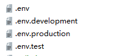

### **配置文件说明**

#### .env 在所有的环境中被载入

```json
NODE_ENV=production
VUE_APP_PLATFORM_NAME=JeecgBoot 企业级快速开发平台
#SSO单点登录开关
VUE_APP_SSO=false     
```

#### .env.development 开发环境中载入（程序启动默认走此配置）

```
NODE_ENV=development
#接口地址
VUE_APP_API_BASE_URL=http://localhost:8080/jeecg-boot
#单点登录地址
VUE_APP_CAS_BASE_URL=http://cas.example.org:8443/cas
#online地址
VUE_APP_ONLINE_BASE_URL=http://fileview.jeecg.com/onlinePreview
```

#### .env.production 生产环境中加载（项目打包默认走此配置）

```
NODE_ENV=production
VUE_APP_API_BASE_URL=https://bootapi.jeecg.com
VUE_APP_CAS_BASE_URL=http://localhost:8888/cas
VUE_APP_ONLINE_BASE_URL=http://fileview.jeecg.com/onlinePreview
```

#### .env.test 测试环境中加载

```
NODE_ENV=production
VUE_APP_API_BASE_URL=http://boot.jeecg.com:8080/jeecg-boot
VUE_APP_CAS_BASE_URL=http://cas.example.org:8443/cas
VUE_APP_ONLINE_BASE_URL=http://fileview.jeecg.com/onlinePreview
```

如果需要用此配置打包，请点击命令

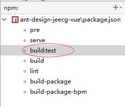

## Docker中安装Elasticsearch

```
docker run --name=elasticsearch6.8.3 -d -p 9200:9200 -p 9300:9300 docker.io/elasticsearch:6.8.3
docker run --name=elasticsearch-head -d -p 9100:9100 docker.io/mobz/elasticsearch-head:5
```

- UI界面（看数据）
  [http://localhost:9100](http://localhost:9100/)
- elasticsearch-head 遇到问题
  https://www.jianshu.com/p/fec0d22ddf8d
- 参考文章
  https://www.jianshu.com/p/3c90f144775f
- Docker安装Elasticsearch7.7.0+elasticsearch-head+springboot(最新文章)
  https://blog.csdn.net/qq_38723394/article/details/106540684