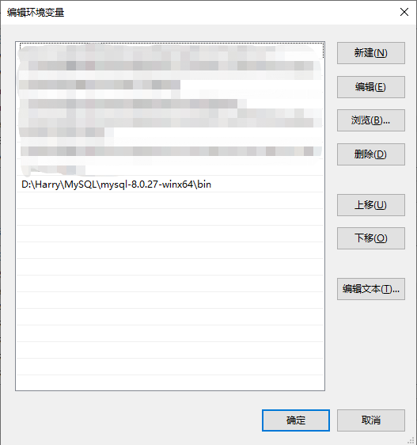

## WINDOWS中配置环境

新增系统环境变量，mysql启动需要用到；


新增path环境变量，通过终端控制的时候需要用到；



## 常用命令

### 启动服务

```bash
net start mysql
```

### 连接MySQL

```bash
#mysql -h [IP地址] -u [数据库] -p;
mysql -u <USERNAME> -p
Enter password:****
```

### 用户管理

```bash
#新增用户
### host - 指定该用户在哪个主机上可以登陆；
### localhost - 是指该用户只能在本地登录，不能在另外一台机器上远程登录；
### % - 表示在任何一台电脑上都可以登录；
create user <USERNAME>@<'%' || 'localhost' || '指定主机地址(host)'>
#删除用户
DELETE FROM mysql.user WHERE user='tester'; 
DROP USER 'userName'@'host';
#修改密码
MYSQLADMIN -u [用户名] -p [旧密码] password [新密码];
UPDATE mysql.user SET password=PASSWORD('新密码') WHERE User='root';#记得刷新
```

### 权限管理

```bash
#授权test用户有testDB数据库的某一部分权限
GRANT select,update ON testDB.* TO test@'%' IDENTIFIED BY 'password';
#授权test用户有testDB数据库的所有操作权限
GRANT all PRIVILEGES ON testDB.* TO 'test'@'%' IDENTIFIED BY 'password';
#授权test用户拥有所有数据库的某些权限
GRANT select,delete,update,create,drop ON *.* TO 'test'@'%' IDENTIFIED BY 'password';
#取消用户所有数据库（表）的所有权限
revoke all on *.* from tester;
```

### 数据库操作

```bash
#查看数据库
show databases;
#选择数据库
use [数据库];
#创建数据库，采用create schema和create database创建数据库的效果一样
create database [数据库名];
#删除数据库
drop database db;
```

### 表操作

```bash
#查看表
show tables;
#新增表
CREATE TABLE `表名` (
  `字段1` varchar(10) PRIMARY KEY NOT NULL COMMENT '字段描述',
  `字段2` varchar(10) DEFAULT NULL COMMENT '字段描述',
  `字段3` varchar(10) DEFAULT NULL COMMENT '字段描述'
) ENGINE=InnoDB DEFAULT CHARSET=utf8 COMMENT='表描述';
#删除表，IF EXISTS表示如果有才删除
DROP TABLE [IF EXISTS] `表名`;
#修改表名
rename table [旧表名] to [新表名];
```

### 列操作

```bash
#查看列
show columns from [表名];
#增加列
alter table [表名] add [列名] char(100) null;
#删除列
alter table [表名] drop column [列明];
#修改列数据类型
ALTER TABLE [表名] ALTER COLUMN [列名] [类型];
```

### 数据操作

```bash
#插入数据
INSERT INTO [表名] VALUES("字段1","字段2"······);
#以文本方式将数据插入表，导入的数据注意规范
LOAD DATA LOCAL INFILE "D:/mysql.txt" INTO TABLE 表名;
#清空表数据
DELECT FROM [表名];
#修改数据
UPDATE 表名 SET <字段名1>='a',<字段名2>='b' WHERE <字段名3>='c';
```

### 备份操作

```bash
#备份数据库
### -d 没有数据
### --add-drop-table 在每个语句前加上drop table **
MYSQLDUMP -u [用户名] -p [密码] [数据库] > [路径/文件名.sql];
MYSQLDUMP -u [用户名] -p -d --add-drop-table [数据库] > [路径/文件名.sql];
mysqldump -up[用户名] -p --default-character-set=latin1 --set-charset=gbk --skip-opt [数据库]> [路径/文件名.sql];
#备份表
MYSQLDUMP -u [用户名] -p [密码] [数据库] > [路径/文件名.sql];
```

