# Navicat Premium 15 永久破解激活工具及安装教程

## 下载：

[Navicat premium 15](http://www.navicat.com.cn/download/navicat-premium)

[破解工具](https://pan.baidu.com/s/1BtEADEk3_3oKc1ic7IHhiQ)，提取码：haqj

## 安装：

不多赘述，安装完即可。

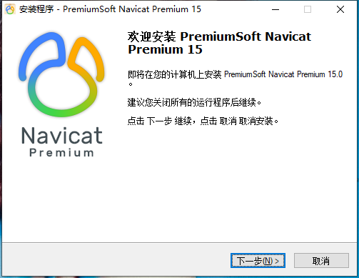

## 破解：

> **前提条件：断网且关闭杀毒软件（windows的安全**）**，****否则会一直报错的**

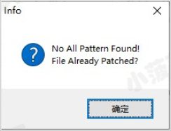

1. 在激活工具的第一个选项(1.Patch)里选择`Backup`，`Host`，Navicat 是那个版本就选哪个版本，这里就选择`Navicat v15` 就好了，然后点击，`Patch`按钮，选择Navicat的安装位置中的navicat.exe文件，如图：

   

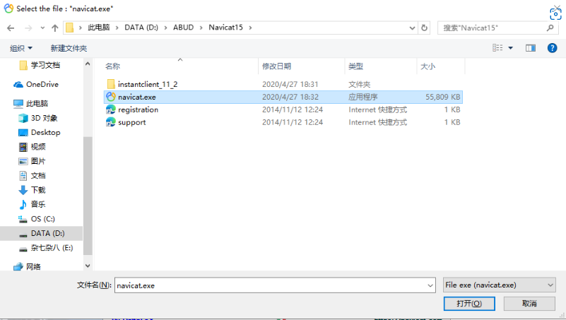

​		出现以下提示说明Patch成功了。

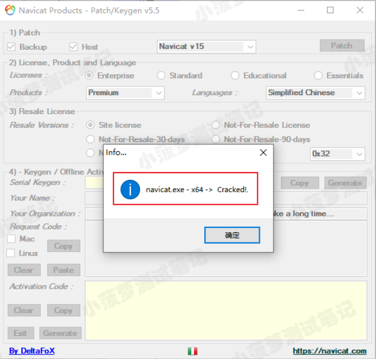

2. License里选中Enterprise、在Produce里选择Premium、在Languages里选择Simplified Chinese(简体中文)

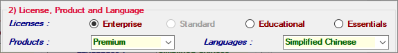

​		Resale License选择Site License

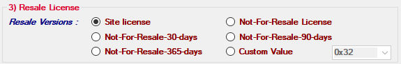

3. 点击Generate按钮就会生成一个许可证秘钥，将许可证秘钥复制后就打开Navicat Premium 15

   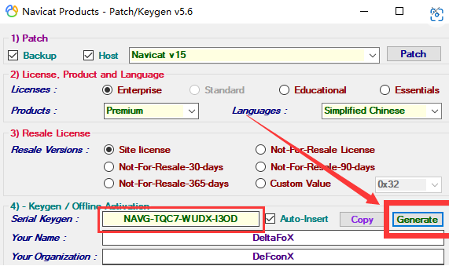

4. 打开Navicat Premium 15，点击注册

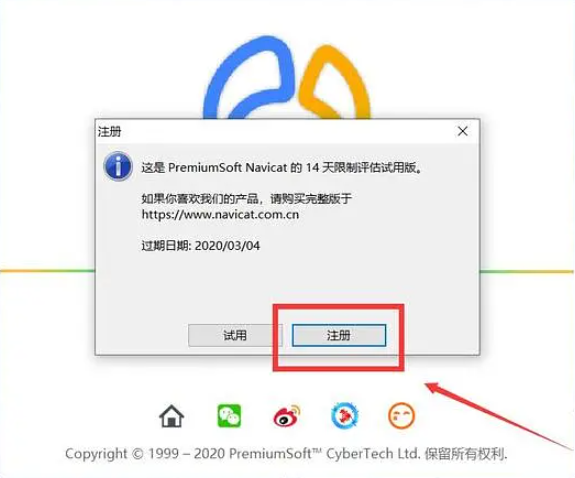

5. 粘贴秘钥，然后点击激活按钮

   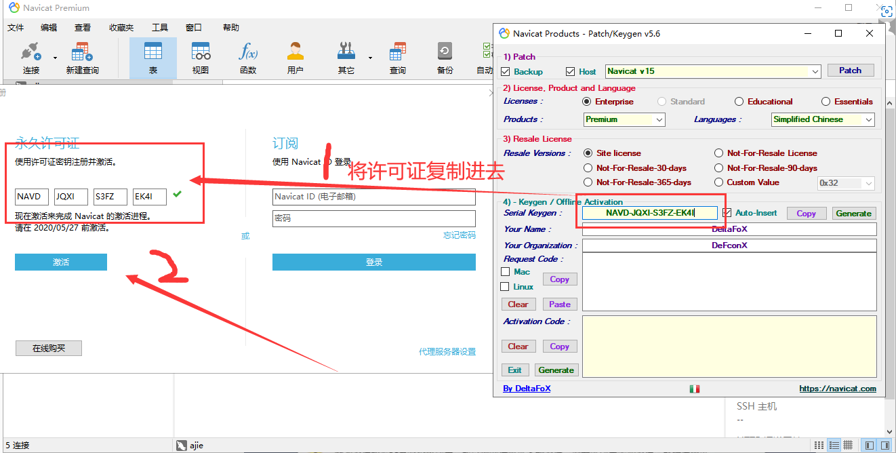

6. 在弹出的界面选择手动激活

   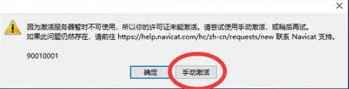

7. 将请求码粘贴到注册机Request Code框中（完整过程看图）

   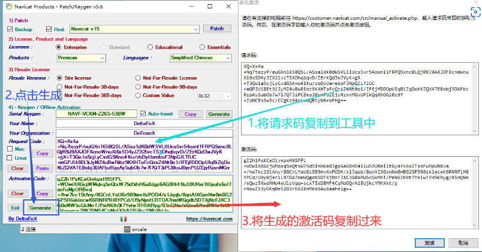

8. 点击激活页面的激活弹出（说明激活成功）

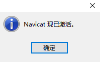

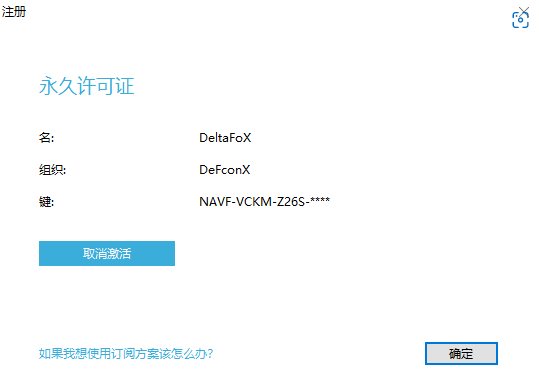

## 参考文档：

[Navicat Premium 15 永久破解激活工具及安装教程(亲测可用)_数据库其它_脚本之家 (jb51.net)](https://www.jb51.net/article/199496.htm)