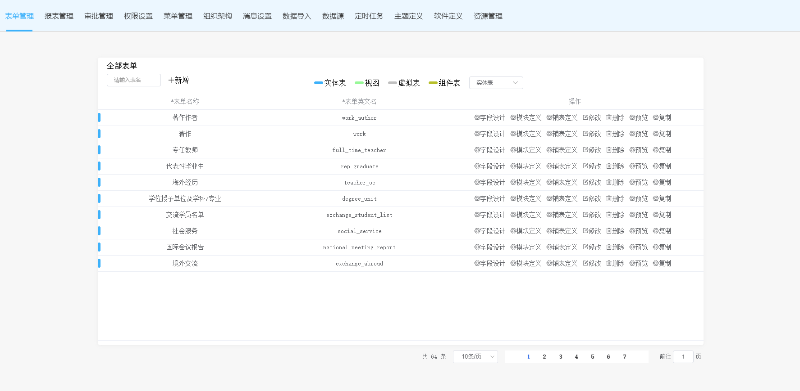
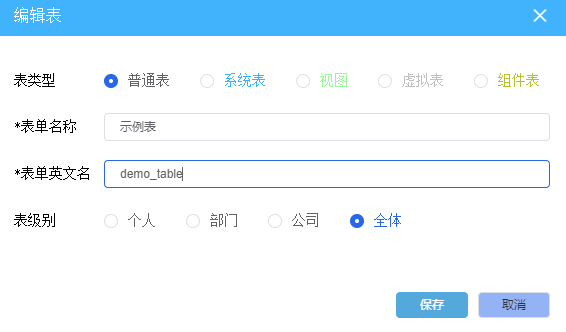
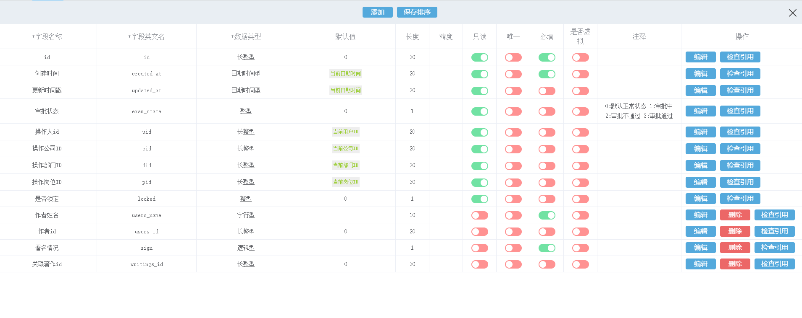
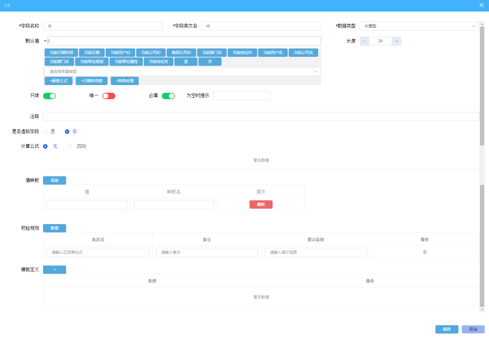
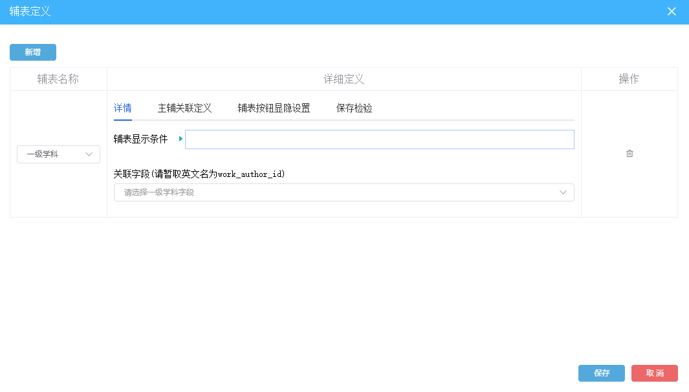

# 一、表单管理

表单分为：实体表、视图表、虚拟表、组件表，其中实体表和组件表较为常用

- 实体表：该表的信息和数据库的表信息是一一对应的，新增表的时候会默认新增部分字段，如id、创建时间和更新时间等。然后，可以根据需求新增或修改字段。
- 系统表：@todo
- 视图：@todo
- 虚拟表：@todo
- 组件表：@todo

表的命名遵循SQL命名规则

表级别：@todo

## 1.字段设计

---

### 1.1表字段设计

字段修改和新增的部分逻辑和SQL相似，其中字段英文名就是对应数据库表中的字段名；数据的类型涵盖绝大部分所需的数据类型；

**默认值**：可以是对应数据类型的常量亦或是其他可选数据或计算公式

**必填**：若字段必填时可以自定义数据为空时的提示内容，若不填则会采用默认的提示内容

**是否虚拟字段**：虚拟字段在数据库中是不存在的，也就是说虚拟字段的信息是不会保存到数据库中的，该字段一般用于计算而得信息。例如年龄是根据出生年份减去当前年份计算而得的，因此该字段不宜在数据库中维护，这时候就可以采用虚拟字段来临时存放年龄的信息。

**计算公式**：@todo

**映射值**：给不同的值添加对应的映射名，如0对应“关闭”，1对应“启动”。配置好映射关系后，在前端的页面中显示的就是映射名而非对应的值了（但被其他表引用的时候除外，如A表引用B表的，那么在A表显示的是值而非映射名@toimprove），其次在数据维护的表单中，存在映射关系的字段的组件将会是下拉列表。

**校验规则**：若添加校验规则则将会在判断必填通过后触发，采用reg.test(data)的校验方式，表达式需要包含在“^”与“$”符号内。

**模板定义**：@todo

### 1.2关系字段设计

---

#### 1.2.1选择关系

用于引入其它表的数据，并于当前的表形成关联，便于用户从其他表中选取特定的数据存放到当前的表中。数据的选取方式包括列表弹窗、选项、级联撒何种方式。@todo

#### 1.2.2联查关系

@todo

#### 1.2.3表关联

@todo

### 1.3列表涉及

---

#### 1.3.1表格

- 列表的宽度可通过拖拽设置宽度大小，也可左右拖动列表排序
- 列表选择器选择需要显示与隐藏的列
- 行内样式设计自定义样式：@todo
- 面板可编辑：是否可以弹窗编辑

#### 1.3.2列表

#### 1.3.3特殊处理

## 2.模块定义

---

@todo

## 3.辅表定义

---

- 新增辅表，选择辅表名称
- 设置辅表显示的条件（可选）
- 选择关联字段，一般选取的是辅表里存储主表id的字段，当然也可以是其他的，如主表为学生表，存有学号字段，辅表为考试成绩表，也存有学号字段，这样就可以用学号字段
- 主辅关联定义：关联主辅表的字段，用于设置主辅表的级联关系
- 辅表按钮显示设置：设置添加和删除按钮的显示条件
- 保存检验：@todo

