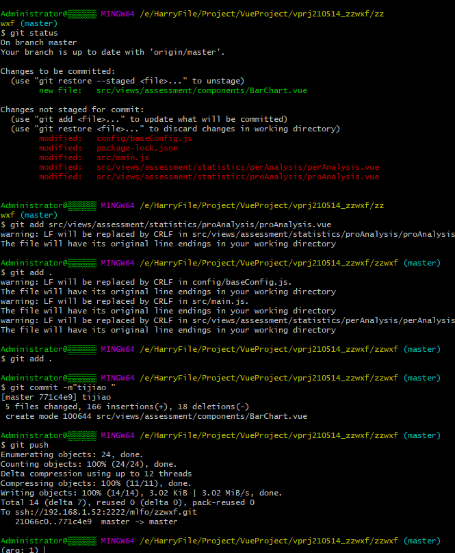
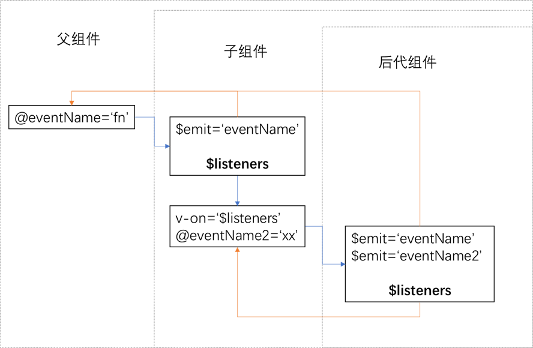
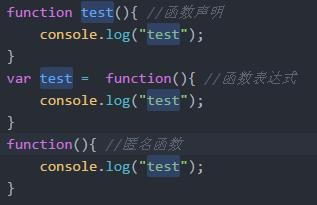
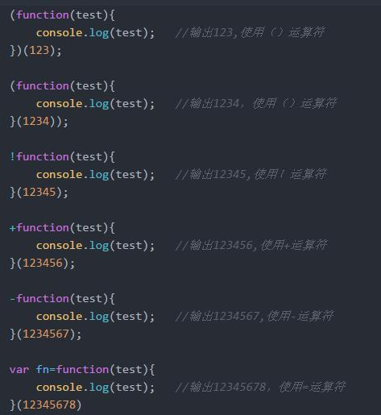
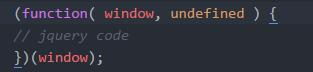

# 1.GIT 

## 1.1基本操作



------

# 2.VUE

## 2.1 VUE实现防止用户未登录直接修改地址路径来访问页面进行拦截功能

在入口文件main.js判断是否存在用户的token，若不存在则跳转到登录页面：

```typescript
// 全局前置导航钩子 beforeEach
// 会在路由即将改变前触发
router.beforeEach((to, from, next) => {
  let isLogin = window.localStorage.getItem('token')
  if (isLogin) {
    next()
  } else {
    if (to.path === '/login') {
      next()
    } else {
      Message.error('没有访问权限或登录已过期，请重新登录！')
      next('/login')
    }
  }
})
```

## 2.2 v-resize

[GitHub - theshying/v-resize: 🎉实时监听元素width/height属性变化的自定义vue指令](https://github.com/theshying/v-resize)

#### 2.2.1 介绍

v-resize 是一个能够实时监听dom元素尺寸变化的自定义vue指令， 我们不需要关心是什么引起变化，无论是flexbox弹性计算引起的变化，还是窗口resize均能监听到，甚至通过控制台修改元素的尺寸。

总之只要这个元素的大小发生变化，均能监听到，且性能很好，不需要去轮询元素的大小。

#### 2.2.2 原理

在支持resizeObserve的浏览器下，我们会优先使用原生resizeObserve来监听变化，否则我们会使用iframe来模拟window的resize事件实现监听

#### 2.2.3 使用

```nginx
npm install @theshy/v-resize --save
```

```vue
//在main.js引入并注册
import vResize from '@theshy/v-resize'
Vue.use(vResize)

//在组件App.vue中

<template>
  <div v-resize="resizeHandler">
  </div>
</template>

<script>
export default {
    name: "App",
    methods: {
        resizeHandler(size) {
            console.log(size); //{width:xx , height: xxx}
        },
    },
};
</script>

```

## 2.3 v-model的修饰符

[v-model的修饰符 - 简书 (jianshu.com)](https://www.jianshu.com/p/2ad32bb94cc2)

#### 2.3.1 v-model.lazy

使用`.lazy`修饰符，会转变为在`change`事件中同步，简单粗暴的讲就是，此时数据并不会像我们以前见到的`v-model`那样实时更新数据，而是在**失去焦点或者回车时更新**，见下面示例代码

#### 2.3.2 v-model.number

需要明确的是，我们输入的数字，虽然输入的是数字，但实际上是`String`，不论你是否让type=‘number’，那么`.number`修饰符就可以将输入的内容转化为`Number`类型

#### 2.3.3 v-model.trim

自动过滤输入的首尾空格

## 2.4 组件数据双向绑定 

```vue
v-bind:value.sync

$emit('update:keyName',Data)

```

作用：对一个 prop 进行“双向绑定”

应用场景：关闭弹框组件

实例：

子组件：

```vue
<template>
  <div v-if="ifshow">
    <p>子组件：{{title}}</p>
    <button @click="close">关闭弹窗</button>
  </div>
</template>
<script>
export default {
    props:{
        title:{
            type:String
        },
        ifshow:{
            type:Boolean
        }

    },
    methods:{
        close(){
            this.$emit('update:ifshow',false);
        }
    }
};
</script>     

```

父组件：

```vue
<template>
  <div>
    <p>父组件：{{title}}  <button @click="show">展示弹窗</button></p>
    <child2 :title="title" :ifshow.sync='ifshow'></child2>
  </div>
</template>
<script>
import child2 from "./child2.vue";
export default {
  components: {
    child2
  },
  data() {
    return {
      title: "努力着，从不放弃",
      ifshow:false
    };
  },
  methods: {
    show(){
      this.ifshow = true;
    }
  }
};
</script>

```

## 2.5 vue中require与import

[vue中require与import之间的区别_CaseyWei-CSDN博客](https://blog.csdn.net/caseywei/article/details/90710749?utm_term=%E5%9C%A8vue%E9%A1%B9%E7%9B%AE%E4%B8%AD%E7%9A%84require&utm_medium=distribute.pc_aggpage_search_result.none-task-blog-2~all~sobaiduweb~default-0-90710749&spm=3001.4430)

- require的基本语法

  在导出的文件中定义module.export,导出的对象的类型不予限定（可以是任何类型，字符串，变量，对象，方法），在引入的文件中调用require()方法引入对象即可

```js
//a.js中
module.export = {
    a: function(){
     console.log(666)
  }
}
```

```js
//b.js中
var obj = require('../a.js')
obj.a()  //666
```

【注】:本质上是将要导出的对象赋值给module这个的对象的export属性，在其他文件中通过require这个方法访问该属性


- import的基本语法
  核心概念：导出的对象必须与模块中的值一一对应，换一种说法就是**导出的对象与整个模块进行解构赋值**。对的，你没有听错。抓住重点，解构赋值！！！！！

  ```js
  //a.js中
  export default{    //（最常使用的方法,加入default关键字代表在import时可以使用任意变量名并且不需要花括号{}）
       a: function(){
           console.log(666)
     }
  }
   
  export function(){  //导出函数
   
  }
   
  export {newA as a ,b,c}  //  解构赋值语法(as关键字在这里表示将newA作为a的数据接口暴露给外部，外部不能直接访问a)
   
  //b.js中
  import  a  from  '...'  //import常用语法（需要export中带有default关键字）可以任意指定import的名称
   
  import {...} from '...'  // 基本方式，导入的对象需要与export对象进行解构赋值。
   
  import a as biubiubiu from '...'  //使用as关键字，这里表示将a代表biubiubiu引入（当变量名称有冲突时可以使用这种方式解决冲突）
   
  import {a as biubiubiu,b,c}  //as关键字的其他使用方法
  ```

**它们之间的区别**

- require 是赋值过程并且是运行时才执行， import 是解构过程并且是编译时执行。require可以理解为一个全局方法，所以它甚至可以进行下面这样的骚操作，是一个方法就意味着可以在任何地方执行。而import必须写在文件的顶部。​	

```js
var a = require(a() + '/ab.js')
```

- require的性能相对于import稍低，因为require是在运行时才引入模块并且还赋值给某个变量，而import只需要依据import中的接口在编译时引入指定模块所以性能稍高

## 2.6 process.env.NODE_ENV

在node中，有全局变量process表示的是当前的node进程。
process.env包含着关于系统环境的信息，但是process.env中并不存在NODE_ENV这个东西。

> NODE_ENV是一个用户自定义的变量，在webpack中它的用途是**判断生产环境或开发环境**。

在vue中我们可以使用`console.log(process);`命令印如下信息：

```dart
$ node process.js
process {
  title: 'node',
  version: 'v4.4.4',
  moduleLoadList: 
   [....],
  versions: 
   { http_parser: '2.5.2',
     node: '4.4.4',
     v8: '4.5.103.35',
     uv: '1.8.0',
     zlib: '1.2.8',
     ares: '1.10.1-DEV',
     icu: '56.1',
     modules: '46',
     openssl: '1.0.2h' },
  arch: 'x64',
  platform: 'darwin',
  release: 
   { name: 'node',
     lts: 'Argon',
     sourceUrl: 'https://nodejs.org/download/release/v4.4.4/node-v4.4.4.tar.gz',
     headersUrl: 'https://nodejs.org/download/release/v4.4.4/node-v4.4.4-headers.tar.gz' },
  argv: 
   [ '/Users/tugenhua/.nvm/versions/node/v4.4.4/bin/node',
     '/Users/tugenhua/个人demo/process.js' ],
  execArgv: [],
  env: 
   { TERM_PROGRAM: 'Apple_Terminal',
     SHELL: '/bin/zsh',
     TERM: 'xterm-256color',
     TMPDIR: '/var/folders/l7/zndlx1qs05v29pjhvkgpmhjm0000gn/T/',
     Apple_PubSub_Socket_Render: '/private/tmp/com.apple.launchd.7Ax4C1EWMx/Render',
     TERM_PROGRAM_VERSION: '404',
     TERM_SESSION_ID: '82E05668-442D-4180-ADA3-8CF64D85E5A9',
     USER: 'tugenhua',
     SSH_AUTH_SOCK: '/private/tmp/com.apple.launchd.MYOMheYcL3/Listeners',
     PATH: '/Users/tugenhua/.nvm/versions/node/v4.4.4/bin:/usr/local/bin:/usr/bin:/bin:/usr/sbin:/sbin',
     PWD: '/Users/tugenhua/个人demo',
     LANG: 'zh_CN.UTF-8',
     XPC_FLAGS: '0x0',
     XPC_SERVICE_NAME: '0',
     SHLVL: '1',
     HOME: '/Users/tugenhua',
     LOGNAME: 'tugenhua',
     SECURITYSESSIONID: '186a8',
     OLDPWD: '/Users/tugenhua/工作文档/sns_pc',
     ZSH: '/Users/tugenhua/.oh-my-zsh',
     PAGER: 'less',
     LESS: '-R',
     LC_CTYPE: 'zh_CN.UTF-8',
     LSCOLORS: 'Gxfxcxdxbxegedabagacad',
     NVM_DIR: '/Users/tugenhua/.nvm',
     NVM_NODEJS_ORG_MIRROR: 'https://nodejs.org/dist',
     NVM_IOJS_ORG_MIRROR: 'https://iojs.org/dist',
     NVM_RC_VERSION: '',
     MANPATH: '/Users/tugenhua/.nvm/versions/node/v4.4.4/share/man:/usr/local/share/man:/usr/share/man:/Applications/Xcode.app/Contents/Developer/Platforms/MacOSX.platform/Developer/SDKs/MacOSX10.13.sdk/usr/share/man:/Applications/Xcode.app/Contents/Developer/usr/share/man:/Applications/Xcode.app/Contents/Developer/Toolchains/XcodeDefault.xctoolchain/usr/share/man',
     NVM_PATH: '/Users/tugenhua/.nvm/versions/node/v4.4.4/lib/node',
     NVM_BIN: '/Users/tugenhua/.nvm/versions/node/v4.4.4/bin',
     _: '/Users/tugenhua/.nvm/versions/node/v4.4.4/bin/node',
     __CF_USER_TEXT_ENCODING: '0x1F5:0x19:0x34' },
  pid: 14034,
  features: 
   { debug: false,
     uv: true,
     ipv6: true,
     tls_npn: true,
     tls_sni: true,
     tls_ocsp: true,
     tls: true },
  _needImmediateCallback: false,
  config: {},
  nextTick: [Function: nextTick],
  _tickCallback: [Function: _tickCallback],
  _tickDomainCallback: [Function: _tickDomainCallback],
  stdout: [Getter],
  stderr: [Getter],
  stdin: [Getter],
  openStdin: [Function],
  exit: [Function],
  kill: [Function],
  mainModule: 
   Module {
     id: '.',
     exports: {},
     parent: null,
     filename: '/Users/tugenhua/个人demo/process.js',
     loaded: false,
     children: [],
     paths: 
      [ '/Users/tugenhua/个人demo/node_modules',
        '/Users/tugenhua/node_modules',
        '/Users/node_modules',
        '/node_modules' ] } }
```

## 2.7 this.$nextTick(callback)--在更新Dom后再触发的回调

官方解释：

​	可能你还没有注意到，Vue 在更新 DOM 时是**异步**执行的。只要侦听到数据变化，Vue 将开启一个队列，并缓冲在同一事件循环中发生的所有数据变更。**如果同一个 watcher 被多次触发，只会被推入到队列中一次。**这种在缓冲时去除重复数据对于避免不必要的计算和 DOM 操作是非常重要的。然后，在下一个的事件循环“tick”中，Vue 刷新队列并执行实际 (已去重的) 工作。Vue 在内部对异步队列尝试使用原生的 `Promise.then`、`MutationObserver` 和 `setImmediate`，如果执行环境不支持，则会采用 `setTimeout(fn, 0)` 代替。

​	例如，当你设置 `vm.someData = 'new value'`，该组件不会立即重新渲染。当刷新队列时，组件会在下一个事件循环“tick”中更新。多数情况我们不需要关心这个过程，但是如果你想基于更新后的 DOM 状态来做点什么，这就可能会有些棘手。虽然 Vue.js 通常鼓励开发人员使用“数据驱动”的方式思考，避免直接接触 DOM，但是有时我们必须要这么做。为了在数据变化之后等待 Vue 完成更新 DOM，可以在数据变化之后立即使用 `Vue.nextTick(callback)`。这样回调函数将在 DOM 更新完成后被调用。

​	在组件内使用 `vm.$nextTick()` 实例方法特别方便，因为它不需要全局 `Vue`，并且回调函数中的 `this` 将自动绑定到当前的 Vue 实例上：

```javascript
Vue.component('example', {
  template: '<span>{{ message }}</span>',
  data: function () {
    return {
      message: '未更新'
    }
  },
  methods: {
    updateMessage: function () {
      this.message = '已更新'
      console.log(this.$el.textContent) // => '未更新'
      this.$nextTick(function () {
        console.log(this.$el.textContent) // => '已更新'
      })
    }
  }
})
```

因为 `$nextTick()` 返回一个 `Promise` 对象，所以你可以使用新的 [ES2017 async/await](https://developer.mozilla.org/zh-CN/docs/Web/JavaScript/Reference/Statements/async_function) 语法完成相同的事情：

```javascript
methods: {
updateMessage: async function () {
this.message = '已更新'
console.log(this.$el.textContent) // => '未更新'
await this.$nextTick()
console.log(this.$el.textContent) // => '已更新'
}
}
```

## 2.8 vue mixins

混入 (mixin) 提供了一种非常灵活的方式，来分发 Vue 组件中的可复用功能。一个混入对象可以包含任意组件选项。当组件使用混入对象时，所有混入对象的选项将被“混合”进入该组件本身的选项。

例子：

```js
// 定义一个混入对象
var myMixin = {
  created: function () {
    this.hello()
  },
  methods: {
    hello: function () {
      console.log('hello from mixin!')
    }
  }
}

// 定义一个使用混入对象的组件
var Component = Vue.extend({
  mixins: [myMixin]
})

var component = new Component() // => "hello from mixin!"
```

#### 2.8.1 选项合并

当组件和混入对象含有同名选项时，这些选项将以恰当的方式进行“合并”。

比如，数据对象在内部会进行递归合并，并在发生冲突时以组件数据优先。

```js
var mixin = {
  data: function () {
    return {
      message: 'hello',
      foo: 'abc'
    }
  }
}

new Vue({
  mixins: [mixin],
  data: function () {
    return {
      message: 'goodbye',
      bar: 'def'
    }
  },
  created: function () {
    console.log(this.$data)
    // => { message: "goodbye", foo: "abc", bar: "def" }
  }
})
```

同名钩子函数将合并为一个数组，因此都将被调用。另外，混入对象的钩子将在组件自身钩子**之前**调用。

```js
var mixin = {
  created: function () {
    console.log('混入对象的钩子被调用')
  }
}

new Vue({
  mixins: [mixin],
  created: function () {
    console.log('组件钩子被调用')
  }
})

// => "混入对象的钩子被调用"
// => "组件钩子被调用"
```

值为对象的选项，例如 `methods`、`components` 和 `directives`，将被合并为同一个对象。两个对象**键名冲突时，取组件对象的键值对**

```js
var mixin = {
  methods: {
    foo: function () {
      console.log('foo')
    },
    conflicting: function () {
      console.log('from mixin')
    }
  }
}

var vm = new Vue({
  mixins: [mixin],
  methods: {
    bar: function () {
      console.log('bar')
    },
    conflicting: function () {
      console.log('from self')
    }
  }
})

vm.foo() // => "foo"
vm.bar() // => "bar"
vm.conflicting() // => "from self"
```

#### 2.8.2 全局混入

混入也可以进行全局注册。使用时格外小心！一旦使用全局混入，它将影响**每一个**之后创建的 Vue 实例。使用恰当时，这可以用来为自定义选项注入处理逻辑。

```js
// 为自定义的选项 'myOption' 注入一个处理器。
Vue.mixin({
  created: function () {
    var myOption = this.$options.myOption
    if (myOption) {
      console.log(myOption)
    }
  }
})

new Vue({
  myOption: 'hello!'
})
// => "hello!"
```

请谨慎使用全局混入，因为它会影响每个单独创建的 Vue 实例 (包括第三方组件)。大多数情况下，只应当应用于自定义选项，就像上面示例一样。推荐将其作为[插件](https://cn.vuejs.org/v2/guide/plugins.html)发布，以避免重复应用混入。

#### 2.8.3 自定义选项合并策略

自定义选项将使用默认策略，即简单地覆盖已有值。如果想让自定义选项以自定义逻辑合并，可以向 `Vue.config.optionMergeStrategies` 添加一个函数：

```js
Vue.config.optionMergeStrategies.myOption = function (toVal, fromVal) {
  // 返回合并后的值
}
```

对于多数值为对象的选项，可以使用与 `methods` 相同的合并策略：

```js
var strategies = Vue.config.optionMergeStrategies
strategies.myOption = strategies.methods	
```

可以在 [Vuex](https://github.com/vuejs/vuex) 1.x 的混入策略里找到一个更高级的例子：

```js
const merge = Vue.config.optionMergeStrategies.computed
Vue.config.optionMergeStrategies.vuex = function (toVal, fromVal) {
  if (!toVal) return fromVal
  if (!fromVal) return toVal
  return {
    getters: merge(toVal.getters, fromVal.getters),
    state: merge(toVal.state, fromVal.state),
    actions: merge(toVal.actions, fromVal.actions)
  }
}
```

#### 2.8.4 不足

在 Vue 2 中，mixin 是将部分组件逻辑抽象成可重用块的主要工具。但是，他们有几个问题：

- Mixin 很容易发生冲突：因为每个 mixin 的 property 都被合并到同一个组件中，所以为了避免 property 名冲突，你仍然需要了解其他每个特性。
- 可重用性是有限的：我们不能向 mixin 传递任何参数来改变它的逻辑，这降低了它们在抽象逻辑方面的灵活性。

为了解决这些问题，我们添加了一种通过逻辑关注点组织代码的新方法：[组合式 API](https://v3.cn.vuejs.org/guide/composition-api-introduction.html)。


------

## 2.9 点击button按钮页面自动刷新问题

### 2.9.1 问题描述：

在vue中使用原生的button，绑定点击事件后点击按钮会自动刷新页面。

### 2.9.2 原因：

原生按钮`button`默认`type='submit'`这个属性值是默认具有表单提交功能的，所以在`非IE浏览器`下会存在点击后刷新页面的问题

### 2.9.3 解决方案：

- 解决方案1：在原生`button`按钮中更改`type='button'`属性值就可以了，此时它就是一个`单纯`的按钮了
- 解决方案2:  可以使用`input`标签，然后再设置`type='button'`也能解决
- 解决方案3:  自己写块元素,通过样式更改为按钮
- 解决方案4:  采用elementUI的`el-button`。

---

## 2.10 组件嵌套时子组件的正确注册方式

问题描述：当一个组件（a）内部的内部需要引入它本身时，代码大致结构如下：

p.vue

```vue
<template>
  <a>
    <button></button>
    <c></c>
  </a> 
</template>

<script>
  import a form 'xxx'
  import c from 'aaa'
</script>
```

c.vue

```vue
<template>
  <a></a>
</template>

<script>
  import a form 'xxx'
</script>
```

这样子代码就会报错，告诉你注册的方式有误。

```
Unknown custom element: <PlanMesgDialog> - did you register the component correctly? For recursive components, make sure to provide the "name" option.
```

正确的注册方式：

子组件应该在beforeCreate的时候进行注册。即

```vue
<script>
	beforeCreate() {
    	this.$options.components.a = require('xxx').default;
  	},
</script>
```

---

## 2.11 理解 v-model、v-bind、$attrs、 $listener 和 .sync 及其在跨组件数据双向绑定上的应用

### 2.11.1 v-model 的本质

```js
<MyList v-model="lovingVue"></MyList
<!-- 其实是以下的语法糖 -->
<MyList :value="lovingVue" @input="(data) => lovingVue = data"></MyList>
```

v-model 的本质是：父组件给子组件传一个名为 `value` 的`prop`，然后对子组件挂载一个名为`input` 的事件监听。当子组件手动 `emit` 这个input 事件时，携带的载荷自动赋值到`v-model`后绑的父组件变量上。（所以其实不是自动双向绑定，还是需要手动`emit` input事件的。）

### 2.11.2 v-bind的本质

本质是 批量传入props

```vue

<Component v-bind="{a: foo, b: bar, c: baz}" />
 <!-- 相当于 -->
<Component
    v-bind:a=foo
    :b=bar
    :c=baz 
/>
```

### 2.11.3 $attrs的本质

父组件以形如:foo="xxx"或者v-bind="{age:12}"传给子组件的属性，但凡没有被子组件的props接收的，都会被扔到子组件的$attrs里去。

（另外，被props指名接收的，都放入子组件的$props里。）

### 2.11.4 $listeners的本质

父组件以 @eventName="fn" 或者 v-on:eventName="fn" 对子组件挂载事件监听。对子组件而言，父组件监听的事件都放在$listeners里。

如果对后代组件使用v-on="$listeners"，则相当于对后代组件批量挂载了父组件对自己的事件监听。因此后代组件的emit也会触发父组件的事件方法。

层级关系说明：父组件>子组件>后代组件



### 2.11.5 .sync的本质

```vue
<Component 
    :foo="val"
    @update:foo="(payload)=>{ val = payload }"
/>
<!-- 实质是 语法糖 -->
<Component :foo.sync="val" />
```

```js
// 子组件使用
this.$emit('update:foo', payload)
```

实质是更方便地实现数据双向绑定。即数据流向父->子天然实现，子->父只需子组件emit相关事件即可，从而实现双向绑定。

```vue
<!-- A Component -->
<template>
    <BComponent v-model="modalShow"></BComponent>
</template>
 
<script>
    this.modalShow = true // 往下传递状态，直接到C
</script>
 
 
<!-- B Component -->
<template>
    <CComponent v-bind="$attrs" v-on="$listeners"></CComponent>
</template>
 
<script>
    // 中间组件也可以中途向两边更改状态,一致性需要手动保持
    // this.$attrs.value = true
    // this.$emit('input', true)
</script>
 
 
<!-- C Component -->
<script>
    props: {
        value:boolean
    },
    methods: {
       handleClose(){
           this.$emit('input', false) // 往上emit状态，直接到A
       } 
    }
</script>
```

总结一下，主要是中间传递组件的 v-bind="$attrs" v-on="$listeners"。

父组件更改了数据，会因为 $atrrs 的传递自然地传递到后代组件。而后代组件 emit 一个 input 事件，会因为 $listeners 自然地冒到父组件处。又因为父组件的 v-model 而自动把新数据赋值到父组件变量上，因此实现了所谓的"双向绑定"。

## 2.12 在Vue往数组的对象原型新增方法

首先创建一个js，并写入相应的代码，这里要注意的是不能使用箭头函数，因为箭头函数和匿名函数的this指向是不一样的，详情参见本文的“vue中this指向问题”

```js
/*prototypeExpand 对象原型的扩展*/
/**
 * 移除数组某一元素
 * @param callback 回调函数
 * @returns {number}
 */
Array.prototype.remove = function (callback){
  let index = this.findIndex(callback);
  if (index > -1) {
    this.splice(index, 1);
  }
  return index
}
```

然后再在main.js中引入。

## 2.13 Vue中this指向问题

对于使用function定义的函数，它里面使用的**this是由它的(执行时的)直接调用者决定**。如果没有**直接调用者**，在非严格模式下，this指向**window**。

**箭头函数没有自己的this**，在它里面使用的this指向的是**定义箭头函数时(注意：并非执行时)**所处的**宿主对象**。

showMessage1()里的this指的是window，而showMessage2()里的this指的是vue实例。

```js
showMessage1: function(){
	setTimeout(function() {
		document.getElementById("id1").innerText = this.message;
	}, 10)
},
showMessage2: function() {
	setTimeout(() => {
		document.getElementById("id2").innerText = this.message;
	}, 10)
}
```

showMessage1里使用了匿名函数，this指向window，showMessage2里定义的箭头函数宿主对象为Vue实例，所以它里面使用的this指向Vue实例。

**为什么要let that = this ？**

> 为了保留this指向，在一些内层函数内（如封装的请求），他的this指向并不是当前的Vue实例，所以要定义一个值保存一下this，在需要访问调用Vue实例的时候使用

## 2.14 CLI 2更换浏览器图标(favicon)的方式

把准备好的图片文件放到根目录，修改 build 文件夹下 webpack.prod.conf.js （生产环境）和 webpack.dev.conf.js（开发环境） 文件：

```js
var path = require('path') // 一般vue-cli会自带，当然了，没有的话，再手动引入

// HtmlWebpackPlugin 中添加 favicon
new HtmlWebpackPlugin({
  filename: 'index.html',
  template: 'index.html',
  favicon: path.resolve('favicon.ico'), // 引入图片地址
  inject: true
})
```

# 3. JS

## 3.1 节流（throttle）防抖（debounce）

#### 3.1.1 前言

 以下场景往往由于事件频繁被触发，因而频繁执行DOM操作、资源加载等重行为，导致UI停顿甚至浏览器崩溃。

1. window对象的resize、scroll事件

2. 拖拽时的mousemove事件

3. 射击游戏中的mousedown、keydown事件

4. 文字输入、自动完成的keyup事件

 实际上对于window的resize事件，实际需求大多为停止改变大小n毫秒后执行后续处理；而其他事件大多的需求是以一定的频率执行后续处理。针对这两种需求就出现了debounce和throttle两种解决办法。

#### 3.1.2 防抖(Debounce)

**1.定义**

如果用手指一直按住一个弹簧，它将不会弹起直到你松手为止。

也就是说当调用动作n毫秒后，才会执行该动作，若在这n毫秒内又调用此动作则将重新计算执行时间。

**2.接口定义：**

```js
/**
* 空闲控制 返回函数连续调用时，空闲时间必须大于或等于 idle，action 才会执行
* @param idle   {number}    空闲时间，单位毫秒
* @param action {function}  请求关联函数，实际应用需要调用的函数
* @return {function}    返回客户调用函数
*/
debounce(idle,action)
```

**3.简单实现**

```js
var debounce = function(idle, action){
  var last
  return function(){
    var ctx = this, args = arguments
    clearTimeout(last)
    last = setTimeout(function(){
        action.apply(ctx, args)
    }, idle)
  }
}
```

#### **3.1.3 节流(throttle)**

**1.定义**

如果将水龙头拧紧直到水是以水滴的形式流出，那你会发现每隔一段时间，就会有一滴水流出。也就是会说预先设定一个执行周期，当调用动作的时刻大于等于执行周期则执行该动作，然后进入下一个新周期。

**2.接口定义**

```js
/**
* 频率控制 返回函数连续调用时，action 执行频率限定为 次 / delay
* @param delay  {number}    延迟时间，单位毫秒
* @param action {function}  请求关联函数，实际应用需要调用的函数
* @return {function}    返回客户调用函数
*/
throttle(delay,action)
```

**3.简单实现**

```js
var throttle = function(delay, action){
  var last = 0return function(){
    var curr = +new Date()
    if (curr - last > delay){
      action.apply(this, arguments)      last = curr     }
  }
}
```


#### **3.1.4 示例**

使用前:

```js
//模拟一段ajax请求
functionajax(content) { 
    console.log( 'ajax request '+ content)
} 
let inputa = document.getElementById( 'unDebounce')
inputa.addEventListener( 'keyup', function(e) { ajax(e.target.value)})
```

运行效果:


可以看到，我们只要按下键盘，就会触发这次ajax请求。不仅从资源上来说是很浪费的行为，而且实际应用中，用户也是输出完整的字符后，才会请求。

使用防抖后:

```js
//模拟一段ajax请求
function ajax(content) { 
    console.log( 'ajax request '+ content)
} 
function debounce(fun, delay) { 
    return function(args) { 
        let that = this 
        let _args = args 
        clearTimeout(fun.id) 
        fun.id = setTimeout( () => {
            fun.call(that, _args) }, delay) 
    }
} 
let inputb = document.getElementById( 'debounce') 
let debounceAjax = debounce(ajax, 500)
inputb.addEventListener( 'keyup', function(e) { debounceAjax(e.target.value) }) 
```

运行效果:


可以看到，我们加入了防抖以后，当你在频繁的输入时，并不会发送请求，只有当你在指定间隔内没有输入时，才会执行函数。如果停止输入但是在指定间隔内又输入，会重新触发计时。

使用节流后:

```js
function throttle(fun, delay) {
    let last, deferTimer 
    return function(args) { 
        let that = this 
        let _args = arguments
        let now = + newDate() 
        if(last && now < last + delay) {
            clearTimeout(deferTimer) 
            deferTimer = setTimeout( function() {
                last = now fun.apply(that, _args) 
            }, delay) 
        } else{
            last = now fun.apply(that,_args) 
        } 
    } 
} 
let throttleAjax = throttle(ajax, 1000) 
let inputc = document.getElementById( 'throttle')
inputc.addEventListener( 'keyup', function(e) {
    throttleAjax(e.target.value)
}) 
```

运行效果:


#### **3.1.5 throttle-debounce插件**

```js
/*
Throttle execution of a function. Especially useful for rate limiting execution of handlers on events like resize and scroll.
Params:
delay: number – A zero-or-greater delay in milliseconds. For event callbacks, values around 100 or 250 (or even higher) are most useful.
noTrailing: boolean – Optional, defaults to false. If noTrailing is true, callback will only execute every delay milliseconds while the throttled-function is being called. If noTrailing is false or unspecified, callback will be executed one final time after the last throttled-function call. (After the throttled-function has not been called for delay milliseconds, the internal counter is reset).
callback: Function – A function to be executed after delay milliseconds. The this context and all arguments are passed through, as-is, to callback when the throttled-function is executed.
debounceMode: boolean – If debounceMode is true (at begin), schedule clear to execute after delay ms. If debounceMode is false (at end), schedule callback to execute after delay ms.
Returns:
A new, throttled, function.
*/
function throttle (delay, noTrailing, callback, debounceMode) 
```

```js
/*
Debounce execution of a function. Debouncing, unlike throttling, guarantees that a function is only executed a single time, either at the very beginning of a series of calls, or at the very end.
Params:
delay: number – A zero-or-greater delay in milliseconds. For event callbacks, values around 100 or 250 (or even higher) are most useful.
atBegin: boolean – Optional, defaults to false. If atBegin is false or unspecified, callback will only be executed delay milliseconds after the last debounced-function call. If atBegin is true, callback will be executed only at the first debounced-function call. (After the throttled-function has not been called for delay milliseconds, the internal counter is reset).
callback: Function – A function to be executed after delay milliseconds. The this context and all arguments are passed through, as-is, to callback when the debounced-function is executed.
Returns:
A new, debounced function.
*/
function debounce (delay, atBegin, callback)
```

## 3.2 判断设备是PC还是手机、平板

```js
this.isMobile = navigator.userAgent.match(/(phone|pad|pod|iPhone|iPod|ios|iPad|Android|Mobile|BlackBerry|IEMobile|MQQBrowser|JUC|Fennec|wOSBrowser|BrowserNG|WebOS|Symbian|Windows Phone)/i)
```

输出的结果是null即为电脑

## 3.3 Window localStorage的使用

```JS
// 存储
localStorage.setItem("lastname", "Smith");
// 检索
document.getElementById("result").innerHTML = localStorage.getItem("lastname");
// 删除
localStorage.removeItem("key");
```

## 3.4 过滤富文本中的标签

```js
val.replace(/<[^>]+>/g, "")
```

## 3.5 删除数组的指定元素

```js
Arr.splice(Arr.findIndex(item=>item==value),1)
```

## 3.6  数组

### 3.6.1  Array.flat()--数组扁平化

数组的成员有时还是数组，Array.prototype.flat()用于将嵌套的数组“拉平”，变成一维数组。该方法返回一个新数组，对原数据没有影响。

```js
[1, 2, [3, 4]].flat()
// [1, 2, 3, 4]
```

上面代码中，原数组的成员里面有一个数组，flat()方法将子数组的成员取出来，添加在原来的位置。

flat()默认只会“拉平”一层，如果想要“拉平”多层的嵌套数组，可以将flat()方法的参数写成一个整数，表示想要拉平的层数，默认为1。

```js
[1, 2, [3, [4, 5]]].flat()
// [1, 2, 3, [4, 5]]
[1, 2, [3, [4, 5]]].flat(2)
// [1, 2, 3, 4, 5]
```

上面代码中，flat()的参数为2，表示要拉平两层的嵌套数组。

如果不管有多少层嵌套，都要转成一维数组，可以用Infinity关键字作为参数。

```js
[1, [2, [3]]].flat(Infinity)
// [1, 2, 3]
```

如果原数组有空位，flat()方法会跳过空位。

```js
[1, 2, , 4, 5].flat()
// [1, 2, 4, 5]
```

flatMap()方法对原数组的每个成员执行一个函数，相当于执行Array.prototype.map(),然后对返回值组成的数组执行flat()方法。该方法返回一个新数组，不改变原数组。

```js
// 相当于 [[2, 4], [3, 6], [4, 8]].flat()
[2, 3, 4].flatMap((x) => [x, x * 2])
// [2, 4, 3, 6, 4, 8]
```

### 3.6.2Array erery()--数组检测

every() 方法用于检测数组所有元素是否都符合指定条件（通过函数提供）。

every() 方法使用指定函数检测数组中的所有元素：

- 如果数组中检测到有一个元素不满足，则整个表达式返回 *false* ，且剩余的元素不会再进行检测。
- 如果所有元素都满足条件，则返回 true。

**注意：** every() 不会对空数组进行检测。

**注意：** every() 不会改变原始数组。

**语法：array.every(function(currentValue,index,arr), thisValue)**

### 3.6.3 Array.concat(arr1,arr2...)--数组拼接

concat() 方法用于连接两个或多个数组。

concat() 方法不会更改现有数组，而是返回一个新数组，其中包含已连接数组的值。

```js
var sedan = ["S60", "S90"];
var SUV = ["XC40", "XC60", "XC90"];
var wagon = ["V60", "V90", "V90CC"];
var Volvo = sedan.concat(SUV, wagon);
```

### 3.6.4  数组元素出现次数计算

```js
Arr.map(item=>item.subject).reduce((prev,next)=>{
  prev[next] = (prev[next]+1)||1
  return prev
},{})
```

### 3.6.5 new Set()--数组去重

```js
Array.form(new set(Arr))//方法一
[...new set(Arr)]//方法二
```

`Array.from()` 方法从一个类似数组或可迭代对象创建一个新的，浅拷贝的数组实例。

`set()`集合,和python集合特性一样,元素唯一，是ES6新增的一个构造函数，用来生成Set数据结构。

### 3.6.6  数组清空的三种方式

方式1，splice

```js
var ary = [1,2,3,4];
ary.splice(0,ary.length);
console.log(ary); // 输出 []，空数组，即被清空了	
```

方式1，splice

这种方式很有意思，其它语言如Java，其数组的length是只读的，不能被赋值。Java中会报错，编译通不过。

```js
var ary = [1,2,3,4]; 
ary.length = 0; 
console.log(ary); // 输出 []，空数组，即被清空了
```

方式3，赋值为[]

```js
var ary = [1,2,3,4]; 
ary = []; // 赋值为一个空数组以达到清空原数组
```

Ext库Ext.CompositeElementLite类的 [clear](http://docs.sencha.com/#method-Ext.CompositeElementLite-clear) 方法使用这种方式清空。

方式1，2 保留了数组其它属性，方式3 则是重新建立个对象

---

## 3.7 树形结构扁平化

```js
 DelayeringTree(tree){
    let arr = []
    for(let i of tree){
      let item = this.CloneDeep(i)
      delete item['children']
      arr.push(item)
      if(i.children){
        arr.push(...this.DelayeringTree(i.children))
      }
    }
    return arr
  }
```

## 3.8 数组与字符串互相转换

数组转字符串

1.toString

2.Arr.join('-') 输出："a-b-c"

字符串转数组

split(): 

1."a,b,c".split(',') 输出："[a,b,c]"

2."abc".split('') 输出同上

## 3.9  对象

### 3.9.1 hasOwnProperty()--检查对象是否有该属性

`hasOwnProperty()`函数用于指示一个对象自身(不包括原型链)是否具有指定名称的属性。如果有，返回`true`，否则返回`false`。

该方法属于`Object`对象，由于所有的对象都"继承"了Object的对象实例，因此几乎所有的实例对象都可以使用该方法。

IE 5.5+、FireFox、Chrome、Safari、Opera等主流浏览器均支持该函数。

**语法**

```
object.hasOwnProperty( propertyName )
```


---

## 3.10 input number类型返回的数据为String

在input中不论你指定的是不是number类型，获取到的数据都是String类型，不过在vue中可以使用v-model.number将数据转为number类型。

## 3.11 对象数组根据某一键值排序

```js
sortListByKey(Arr, key) {
  Arr = Arr.sort((start, end) => {
    if(start[key] > end[key])
      return 1;
    else if(start[key] < end[key])
      return -1;
    else
      return 0;

  })
},
```

------

## 3.12 break,continue和return的用法及区别

1、break：是立即结束语句，并跳出语句，进行下个语句执行。

2、continue：是停止当前语句，并从头执行该语句。

3、return：停止函数。

4、使用的语句环境不一样，break和continue是用在循环或switch语句中，return是用在函数语句中。

---

## 3.13 时间函数

### 3.13.1 Date.setDate() 设置一个月的某一天

```js
var d = new Date("July 21, 1983 01:15:00");
d.setDate(15);
```

 输出结果:

```
Fri Jul 15 1983 01:15:00 GMT+0800 (中国标准时间)
```

## 3.14 find(), findIndex(),indexof的区别

find()方法和findIndex()分别用于找出数组第一个符合条件的元素和元素下标，不适用于字符串；

indexOf(value, index)用于检测字符串或数组中某一元素的首次出现的位置，index规定开始检测的位置；

## 3.15 encodeURI()，encodeURIComponent()，escape()区别

**encodeURI()函数：**

encodeURI() 函数可把字符串作为 URI 进行编码。该方法不会对 ASCII 字母和数字进行编码，也不会对这些 ASCII 标点符号进行编码： - _ . ! ~ * ' ( ) 。

该方法的目的是对 URI 进行完整的编码，因此对以下在 URI 中具有特殊含义的 ASCII 标点符号，encodeURI() 函数是不会进行转义的：;/?:@&=+$,#

**encodeURIComponent() 函数：**

encodeURIComponent() 函数可把字符串作为 URI 组件进行编码。该方法不会对 ASCII 字母和数字进行编码，也不会对这些 ASCII 标点符号进行编码： - _ . ! ~ * ' ( ) 。其他字符（比如 ：;/?:@&=+$,# 这些用于分隔 URI 组件的标点符号），都是由一个或多个十六进制的转义序列替换的。

**escape()函数（已弃用）：**

escape() 函数可对字符串进行编码，这样就可以在所有的计算机上读取该字符串。该方法不会对 ASCII 字母和数字进行编码，也不会对下面这些 ASCII 标点符号进行编码： - _ . ! ~ * ' ( ) 。其他所有的字符都会被转义序列替换。

 **总结：**

 通过对三个函数的分析，我们可以知道：escape()除了 ASCII 字母、数字和特定的符号外，对传进来的字符串全部进行转义编码，因此如果想对URL编码，最好不要使用此方法。而encodeURI() 用于编码整个URI,因为URI中的合法字符都不会被编码转换。encodeURIComponent方法在编码单个URIComponent（指请求参 数）应当是最常用的，它可以将参数中的中文、特殊字符进行转义，而不会影响整个URL。

## 3.16 将字符串用作代码执行-- eval()

`eval()` 函数会将传入的字符串当做 JavaScript 代码进行执行，返回字符串中代码的返回值。如果返回值为空，则返回 `undefined`。如果 `eval()` 的参数不是字符串， `eval()` 会将参数原封不动地返回。

eval是存在安全隐患的，不推荐使用！

```js
eval(string)
```

## 3.17 立即执行函数与单例模式

立即执行函数常用于第三方库，好处在于隔离作用域，任何一个第三方库都会存在大量的变量和函数，为了避免变量污染（命名冲突），开发者们想到的解决办法就是使用立即执行函数。

1.什么是立即执行函数（IIFE）

在了解立即执行函数之前先明确一下函数声明、函数表达式及匿名函数的形式，如下图：



接下来看立即执行函数的两种常见形式：`( function(){…} )()`和`( function (){…} () )`，一个是一个匿名函数包裹在一个括号运算符中，后面再跟一个小括号，另一个是一个匿名函数后面跟一个小括号，然后整个包裹在一个括号运算符中，这两种写法是等价的。要想立即执行函数能做到立即执行，要注意两点，一是函数体后面要有小括号()，二是函数体必须是函数表达式而不能是函数声明。先看下图：



从图中可以看出，除了使用()运算符之外，！，+，-，=等运算符都能起到立即执行的作用。这些运算符的作用就是将匿名函数或函数声明转换为函数表达式，如下图所示，函数体是函数声明的形式，使用运算符将其转换为函数表达式之后就可达到立即执行效果。

2.使用立即执行函数的好处

通过定义一个匿名函数，创建了一个新的函数作用域，相当于创建了一个“私有”的命名空间，该命名空间的变量和方法，不会破坏污染全局的命名空间。此时若是想访问全局对象，将全局对象以参数形式传进去即可，如jQuery代码结构:



其中window即是全局对象。给其传入参数这样的好处是，可以缩短查询时的作用域链。作用域隔离非常重要，是一个JS框架必须支持的功能，jQuery被应用在成千上万的JavaScript程序中，必须确保jQuery创建的变量不能和导入他的程序所使用的变量发生冲突。

单例模式的实现：

```js
var car = {
    speed:0,
    start:function(){ this.speed=40; },
    getspeed:function(){ return this.speed; }
};
car.start();
console.log(car.getspeed()); //print 40
```

这个对象有其成员变量`spee`及成员函数`start`和`getspeed`，但是它的成员变量没有私有化，同时它也没有办法被继承。要实现对象的继承，你可以使用构造函数和原型继承。但怎么才能将成员变量私有化来实现对象的封装呢（而且有时候我们也不想那么麻烦使用原型）？

```js
function car() {
    var speed = 0;
    return { //返回的是一个对象
        start:function() {
            speed = 50;
        },
        getspeed:function () {
         return speed;
        }
    }
}
 
var car1 = car();
car1.start();
console.log(car1.getspeed()); //print 50
```

答案就是使用闭包，有了闭包函数来帮你创建`car`对象，这个函数就类似于工厂方法，它可以根据你的需要创建多个不同的对象。不过开发的时候经常遇到这样的情况，就是我们希望**对象只有一份**，比如jQuery库的对象，它必须确保整个程序只有一份，多了也没有。在后端开发模式中，这叫**单例模式**，可以通过私有化构造函数来实现，那么在js里呢？

既然函数没法私有化，那么唯一的办法就是让这个工厂方法能且只能被调用一次。不能多次调用，那这个函数一定要是匿名函数；而且只能被调用一次，那就必须在声明的时候立马执行。这时候，我们就可以用到立即执行函数了：

```js
var car = (function () {
    var speed = 0;
    return {
        start:function () {
           speed=60;
        },
        getspeed:function () {
           return speed;
        }
    }
})();
 
car.start();
console.log(car.getspeed()); //print 60  
```

这里的car已经不是一个函数了，而是这个匿名的工厂方法执行完返回的对象，该对象拥`start`和`getspeed`两个成员函数，而这两个函数所需要访问的`speed`变量对外不可见。同时你无法再次调用这个匿名的工厂方法来创建一个相同的对象。一个单例的，有着私有成员的对象就这么建好了。

## 3.18 (0, fn)(...)写法的作用

```cpp
console.log((1, 2)); // 结果为2
console.log((a = b = 3, c = 4)); // 结果为4
```

可以看出**逗号操作符** 对它的每个操作对象求值（从左至右），然后返回**最后一个操作对象的值**。

```js
function test() {
  var x = 2, y = 4;
  console.log(eval('x + y'));  // 直接调用，使用本地作用域，结果是 6
  var geval = eval; // 等价于在全局作用域调用
  console.log(geval('x + y')); // 间接调用，使用全局作用域，throws ReferenceError 因为`x`未定义
  (0, eval)('x + y'); // 另一个间接调用的例子
}
```

这里的` (0, eval)('x + y');`是对eval的间接调用，且使用的是全局作用域

```js
var a = {
  foo: function() {
    console.log(this === window);
  }
};

a.foo(); // Returns 'false' in console
(0, a.foo)(); // Returns 'true' in console
```

这时候 `this`的是全局对象 `window`, 所以打印结果为 `true`，所以该写法的作用就是将函数的作用域提升至全局作用域。

## 3.19 a=b=1和a=1,b=1的区别

```js
function test(){var a = b = 1}
test()//调用
console.log(b, a)//b为1，a为undefined（报错）
```

结论：a = b = 1的写法会导致b变为全局变量，而a=1,b=1则是标准的写法，所以通常情况下不推荐a = b = 1的写法；其次a = b  = c = 1则是将b，c变为全局变量。当然，这要在局部作用域（test）被调用之后才会发生变化

# 4. CSS

## 4.1 /deep/ 深度选择器

需求：在某一组件中想要修改全局组件的样式（全局样式），但又不想直接修改全局组件的样式，而是仅在当前组件引用时更改，如：一组件要更改element对话框的内容（.el-dialog .el-dialog__body）的高度，但又不能影响到其它组件的正常使用。这种时候就需要用到/deep/.

```css
/deep/ .el-dialog .el-dialog__body{
  max-height: 71vh;
}
```

注意是在scope里更改。

## 4.2 Flex 布局

https://www.ruanyifeng.com/blog/2015/07/flex-grammar.html

## 4.3 隐藏input number的箭头

```javascript
.input_number{
    input::-webkit-outer-spin-button,
    input::-webkit-inner-spin-button {
        -webkit-appearance: none;
    }
    input[type="number"]{
        -moz-appearance: textfield;
    }
}
```

## 4.4 Vue引入Scss全局变量

在vue.config.js配置如下：

```js
css: {
    loaderOptions: {
      //scss引入全局变量
      // 不同 sass-loader 版本对应关键字， v8-: data   v8: prependData   v10+: additionalData
      sass: {
        data: `@import "@/style/variables.scss";`
      },
      scss: {
        data: `@import "@/style/variables.scss";`
      }
    }
  },
```


------

# 5. Elements

## 5.1 el-date-picker选择数据后无法更新回显数据

#### 5.1.1 问题描述：

如下代码，在点击选择新的日期之后，el-date-picker显示的还是原来的日期，并且也没有触发change事件。

```vue
<el-date-picker
  v-model="row.dateRange"
  @change="handleDateChange($event,row)"
  value-format="yyyy-MM-dd"
  type="daterange"
  range-separator="—"
  :clearable="false"
  :picker-options="pickerOptions"
  start-placeholder="开始日期"
  end-placeholder="结束日期">
</el-date-picker>
```

```js
/**
 * 日期数据存储处理
 * @param row
 */
handleDateChange(data,row){
  this.$set(row,'timeNames',row.dateRange.toString())
  this.handleItemValueChange(row,'timeNames')
},
```


#### 5.1.2 原因：

首先v-model绑定的是对象里的一个值，而这一个值在之前有被重新赋值过，而赋值的方式只是简单的等号赋值。

```js
for (let item of planMode.detailList) {
  if (item.timeNames) item['dateRange'] = item.timeNames.split(',')
}
```

#### 5.1.3 解决方法：

把等号赋值改成$set的赋值方式，具体原理不明，有待补充！

```js
for (let item of planMode.detailList) {
  if (item.timeNames) this.$set(item,'dateRange',item.timeNames.split(','))
}
```


------

## 5.2 Form表单中回车事件出现页面刷新问题

### 5.2.1  问题描述：

在给输入框添加回车事件时，发现一按回车，页面就刷新了。

### 5.2.2 原因：

由于当form表单只有一个文本框时，按下回车将会触发表单的提交事件， 导致页面的刷新。

### 5.2.3 解决方案：

在el-from 加上 @submit.native.prevent

---


# 6.DOS

## 6.1 Windows切换盘符

cd /d  x:    x可以是你要切换的任意盘符

# 7.浏览器兼容性

## 7.1火狐浏览器

### 7.1.1 Firefox下代码触发a标签的click事件无效

以下代码在火狐52版本中实测无效，在94版本中可行。

```js
let ela = document.createElement('a')
ela.href = url
ela.target = '_blank'
fname && (ela.download = fname)
ela.click();
```

原因：

> Before Firefox 5, `click()` is only defined on buttons and inputs, and has no effect on text and file inputs.

​																																							[——引自MDN](https://developer.mozilla.org/zh-CN/docs/Web/API/HTMLElement/click)

解决方案：

```js
let ela = document.createElement('a')
ela.href = url
ela.target = '_blank'
fname && (ela.download = fname)
let evt = document.createEvent("MouseEvents");
evt.initEvent("click",true,true);
ela.dispatchEvent(evt);
```

### 7.1.2  Firefox下内联框架iframe无法显示

以下代码在火狐52版本中实测无效，在94版本中可行。

```html
<iframe
    class="flex-auto"
    :ware_id="ware_id"
    ref="iframe"
    height='100%'
    width='100%'
    scrolling='no'
    frameborder="0"
    allowfullscreen
    webkitallowfullscreen
    :src="`/#/pdffull/${ware_id}/${course_id}/${chapter_id}`">
</iframe>
```

原因：

> 在Firefox低版本中，不能通过src来设置load页面的地址，需要通过href来设置。

​																												[——引自CSDN](https://blog.csdn.net/vicky_lxw/article/details/51079078)

解决方案：

利用js：HTMLElement.contentWindow.location.href="....";

```js
mounted() {
    const url = `/#/pdffull/${this.ware_id}/${this.course_id}/${this.chapter_id}`
    this.$refs.iframe.contentDocument.location.href=url
}
```

### 7.1.3 Firefox下el-input点击事件失效

以下代码的点击事件在火狐94或更低版本中无效，更高版本目前未知。

```js
<el-input 
	class="input-show cpointer" 
    :value="showValue" 
	placeholder="请选择" 
	disabled
    @click.native="showDialog">
```

原因：

> 在Firefox中，disabled会同时禁用掉元素中所绑定的事件

解决方案：

去除disabled或者将disabled替换成readonly

```js
<el-input 
	class="input-show cpointer" 
    :value="showValue" 
	placeholder="请选择" 
	readonly
    @click.native="showDialog">
```

---

## 7.2 谷歌浏览器

### 7.2.1 Google49的flex布局中，子元素height设置为100%失效

问题描述：以下代码中，“children”容器的100%是无效。它不会占满它的父容器，只会根据自身大小决定高度。

```vue
<div style="display: flex;height: 100Vh">
  <div style="flex: none;height: 50px">
    xxx
  </div>
  <div style="flex: auto;">
    <div id="children" style="height: 100%">
      ……
    </div>
  </div>
</div>
```

原因：

> 在Google49中，flex布局下的子容器设置高度为100%时，父容器的没有可以参考的高度，故100%失效

解决方案：

1.在“flex: auto;”的容器中确定好当前容器的具体高度（特殊情况下也可能是用百分比，依实际情况而论），这样“children”的100%就可以参考它的父容器了，但“flex:auto”可能会没有存在的意义了；

```vue
<div style="display: flex;height: 100Vh">
  <div style="flex: none;height: 50px">
    xxx
  </div>
  <div style="flex: auto;height: calc(100% - 50px)">
    <div id="children" style="height: 100%">
      ……
    </div>
  </div>
</div>
```

2.将“children”的父容器也设为flex布局，然后“children”再用“flex:auto”将高度撑开。

```vue
<div style="display: flex;height: 100Vh">
  <div style="flex: none;height: 50px">
    xxx
  </div>
  <div style="flex: auto;display: flex">
    <div id="children" style="height: 100%;flex: auto;">
      ……
    </div>
  </div>
</div>
```

说明：

如果使用了弹性布局（flex），那就没有必要使用height:100%，用flex:auto撑开就好了
